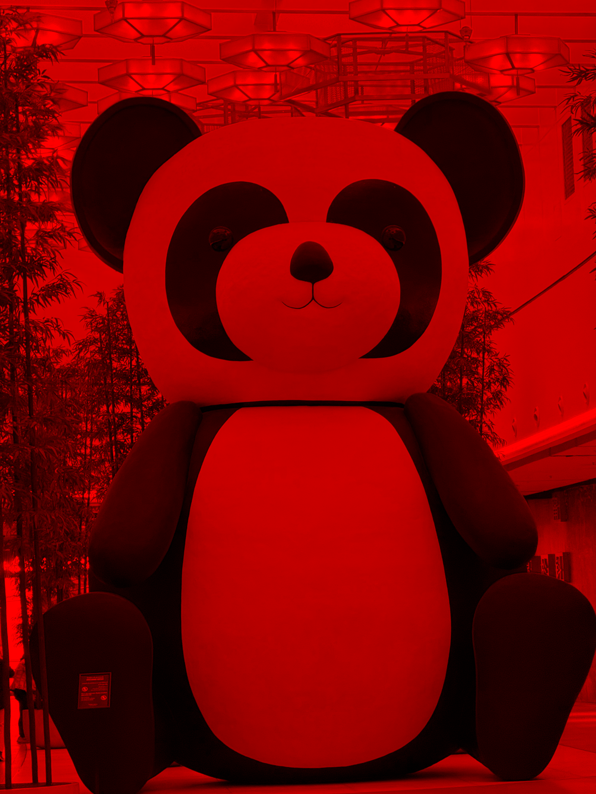
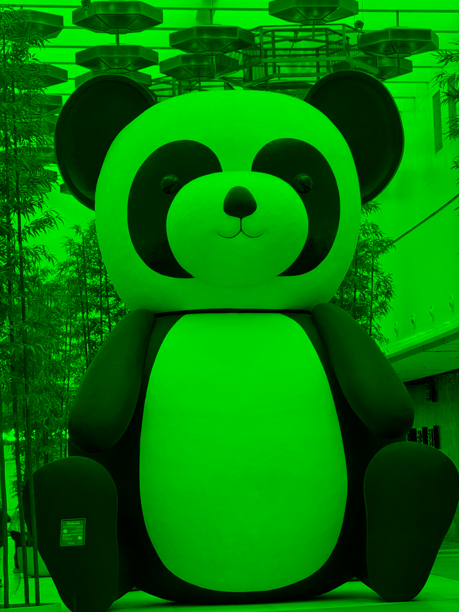
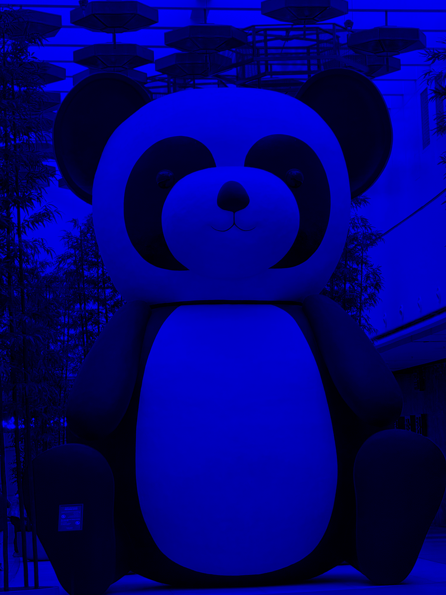
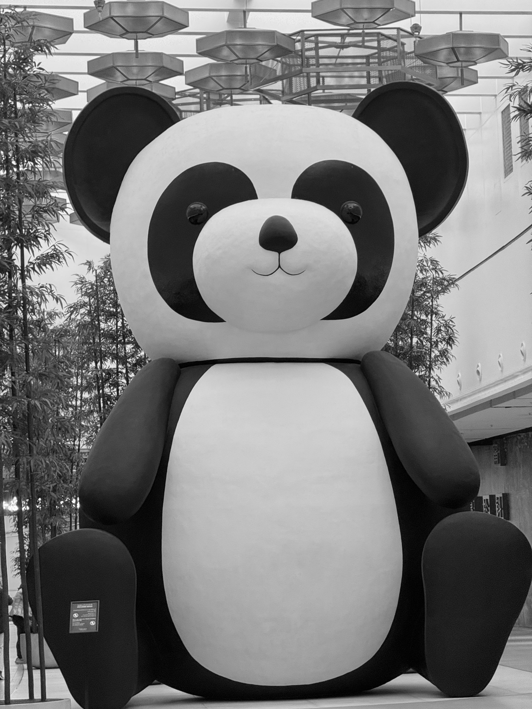
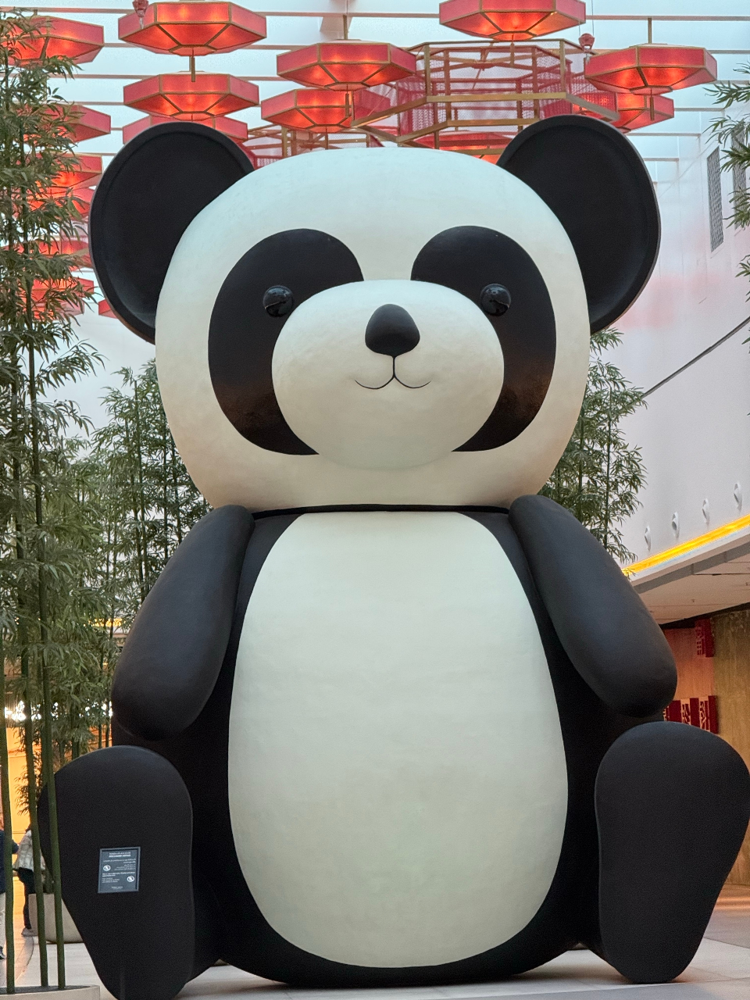

# Лабораторная работа №1

**Цветовые модели и передискретизация изображений**

---

## Исходные данные

Исходное изображение:

---

# 1. Цветовые модели

## 1.1 Выделение компонент RGB

Были выделены компоненты R, G и B исходного изображения.

### Компонента R

### Компонента G

### Компонента B

---

## 1.2 Преобразование в модель HSI

Изображение было преобразовано в цветовую модель HSI.
Из нее была выделена яркостная компонента.

### Яркость (I)

---

## 1.3 Инверсия яркости

### Результат инверсии яркости

---

# 2. Передискретизация

## 2.1 Растяжение изображения (интерполяция)

Изображение увеличено в **M = 2 разa**.

### После

---

## 2.2 Сжатие изображения (децимация)

Изображение уменьшено в **N = 2 разa**.

### После

---

## 2.3 Передискретизация в два прохода (M/N)

Изображение сначала увеличено в **3 разa**, затем уменьшено в **2 разa**.

Коэффициент:
**K = 3 / 2**

### Результат

---

## 2.4 Передискретизация за один проход

Изображение было передискретизировано сразу с коэффициентом **K = 3 / 2**.

### Результат

