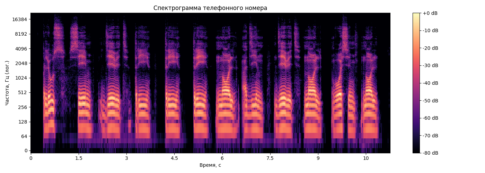
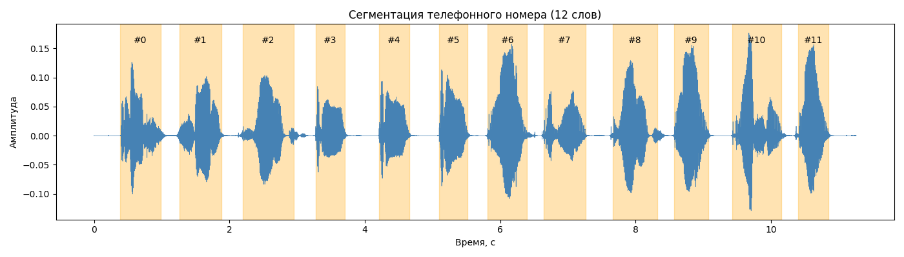

# Лабораторная работа №10. Обработка голоса

Вариант 3. Анализатор речи.

## Запись алфавита

С помощью микрофона записаны 11 эталонных моно WAV-файлов - алфавит распознавателя - цифры 0-9 и "плюс".
Также записан собственный номер телефона в файл phone.wav. Все записи моно, частота дискретизации 44100 Гц.

## Спектрограмма номера

Спектрограмма построена методом STFT с окном Ханна:

На спектрограмме отчетливо видны отдельные участки энергии, соответствующие произнесенным словам, и тихие промежутки между ними.

## Сегментация дорожки

### Результат

Каждый оранжевый блок - один сегмент (одно произнесенное слово). Сегментация определила правильное число слов в номере.

## Распознавание номера

Для каждого сегмента вычисляется DTW-расстояние до всех 11 эталонов. В качестве распознанного слова выбирается эталон с минимальным расстоянием.

### Достоверность

Достоверность распознавания оценивается как отношение расстояния до второго наилучшего варианта к расстоянию до лучшего:

$$\text{confidence} = \frac{d_2}{d_1}$$

Чем оно больше - тем увереннее распознавание (ближайший конкурент сильно дальше).

### Результаты распознавания

| # | Распознано | Лучшая дистанция | Топ-3 гипотезы |
|:---:|:---:|:---:|:---|
| 0 | + | 3.244 | `+` (3.24), `4` (3.68), `1` (3.72) |
| 1 | 7 | 3.077 | `7` (3.08), `4` (3.36), `3` (3.52) |
| 2 | 9 | 3.139 | `9` (3.14), `4` (3.28), `3` (3.41) |
| 3 | 8 | 3.816 | `8` (3.82), `7` (3.84), `4` (3.86) |
| 4 | 3 | 3.451 | `3` (3.45), `4` (3.73), `+` (3.86) |
| 5 | 3 | 3.612 | `3` (3.61), `7` (3.78), `4` (3.86) |
| 6 | 0 | 3.375 | `0` (3.37), `2` (3.69), `4` (4.15) |
| 7 | 1 | 3.247 | `1` (3.25), `7` (3.63), `4` (3.65) |
| 8 | 9 | 3.280 | `9` (3.28), `4` (3.32), `3` (3.52) |
| 9 | 0 | 3.466 | `0` (3.47), `2` (3.65), `7` (3.99) |
| 10 | 8 | 3.190 | `8` (3.19), `7` (3.45), `+` (3.46) |
| 11 | 0 | 3.323 | `0` (3.32), `2` (3.77), `1` (3.95) |

### Итог
| | |
|---|---|
| Ожидалось | +79333019080 |
| Распознано | +79833019080 |
| Ошибок | 1 из 12 |
| Точность | 91.7% |
| Средняя достоверность | 1.07 |

## Выводы

Реализован простой анализатор речи, способный распознавать произнесённые по одной цифры. Алгоритм включает три этапа:
1. Сегментация звуковой дорожки на отдельные слова по уровню энергии с дополнительной защитой от внутренних пауз в словах.
2. Извлечение признаков - MFCC, моделирующих особенности человеческого восприятия звука.
3. Сопоставление с эталонами через DTW, устойчивое к разной длительности произнесения.

В эксперименте достигнута точность 91.7% (11 из 12 цифр распознаны верно).

Основные источники ошибок в такой системе:
- похожие по звучанию слова (например, «ноль»/«восемь», «два»/«три»);
- разная интонация при записи эталона и распознаваемой фразы;
- сегментация - слова с внутренними паузами (типа «девять») могут разрезаться, а слитно произнесенные - склеиваться.
