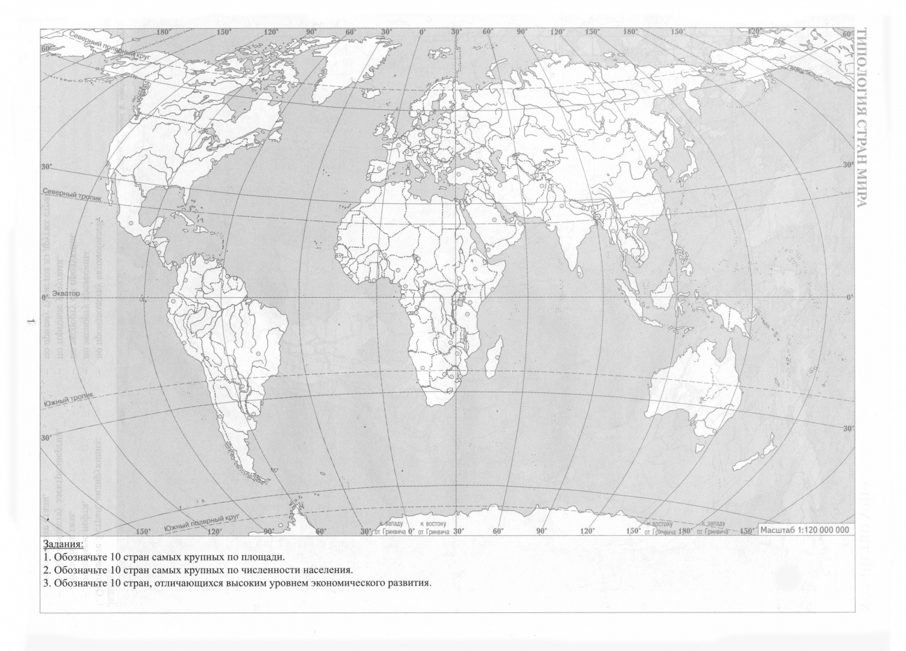
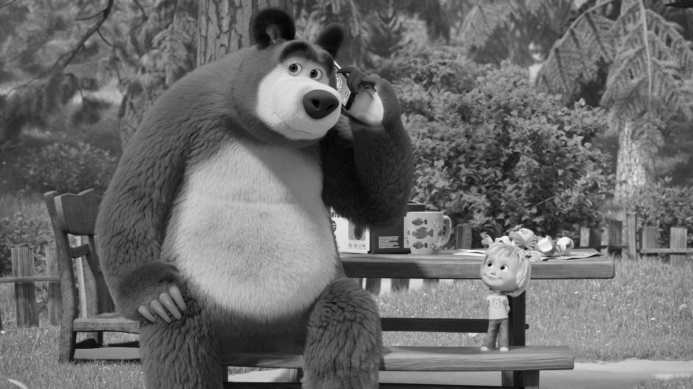
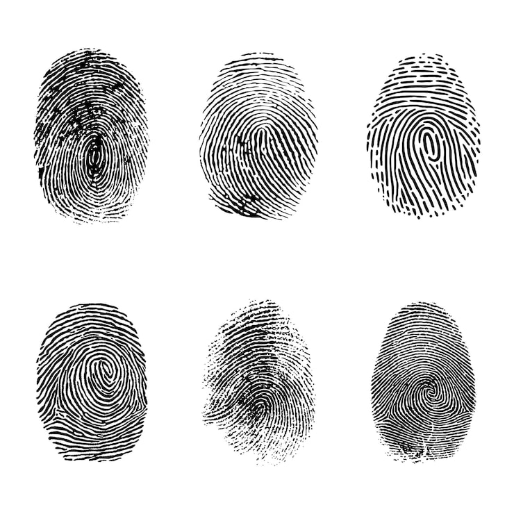
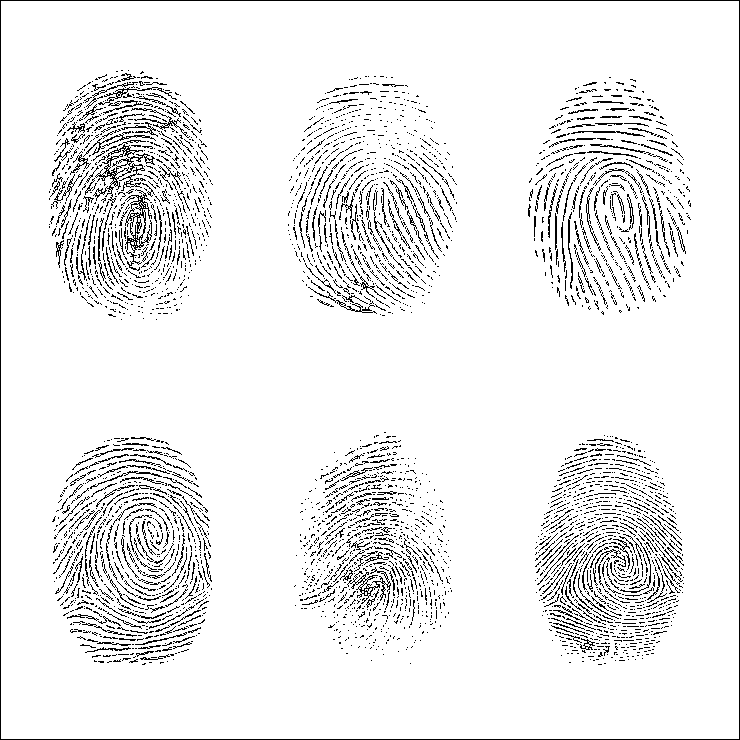
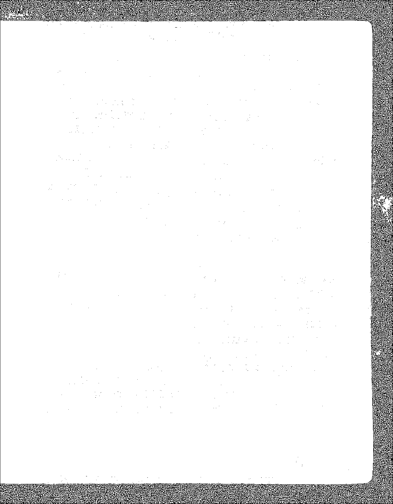

# Лабораторная работа №2  
## Обесцвечивание и бинаризация растровых изображений
### Вариант 5

---

## Задание

1. Привести полноцветное изображение к полутоновому.
2. Выполнить бинаризацию полутонового изображения методом адаптивной пороговой обработки (метод Эйквила, окно 3×3).
3. Продемонстрировать результат на нескольких изображениях.

---

### Перевод в полутоновое изображение

Яркость пикселя вычисляется как взвешенное среднее значений цветовых каналов:

\[
Y = 0.299R + 0.587G + 0.114B
\]

где:
- \(R\), \(G\), \(B\) — значения красного, зелёного и синего каналов соответственно.

---

### Адаптивная бинаризация (метод Эйквила)

Для каждого пикселя вычисляется среднее значение яркости в локальном окне 3×3.

Далее применяется правило:
- если значение пикселя больше среднего → пиксель становится белым (255)
- иначе → чёрным (0)

---

## Ход работы

Обработка выполнялась для 5 изображений.

---

### Изображение 1

**Оригинал:**

**Полутоновое:**

**Бинаризация:**

---

### Изображение 2

**Оригинал:**

**Полутоновое:**

**Бинаризация:**

---

### Изображение 3

**Оригинал:**

**Полутоновое:**

**Бинаризация:**

---

### Изображение 4

**Оригинал:**

**Полутоновое:**

**Бинаризация:**

---

### Изображение 5

**Оригинал:**

**Полутоновое:**

**Бинаризация:**

