# Лабораторная работа №2. Обесцвечивание и бинаризация растровых изображений

Вариант 5: Адаптивная бинаризация Айквиль, малое окно 3×3.

## Исходные изображения

В качестве исходных взяты полноцветные изображения разной природы

## Задание 1. Приведение к полутону

Каждый пиксель полноцветного RGB-изображения преобразуется в один яркостный канал по формуле взвешенного усреднения:

$$Y = 0{,}299 \cdot R + 0{,}587 \cdot G + 0{,}114 \cdot B$$

Примеры (до / после):

| Цветное | Полутоновое |
|---|---|
| 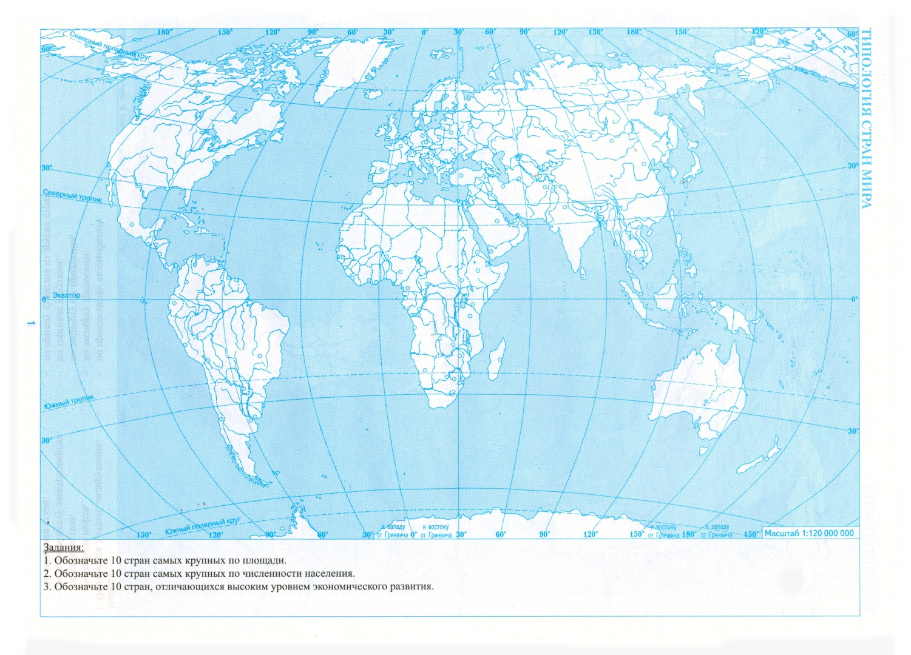 | 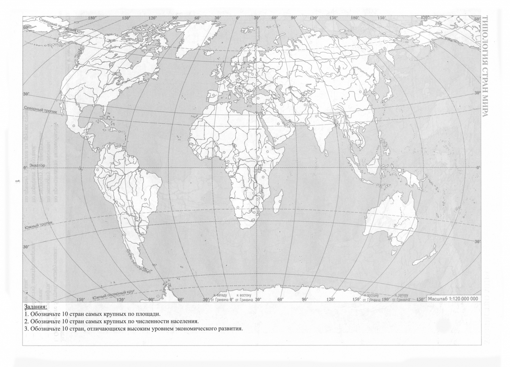 |
| 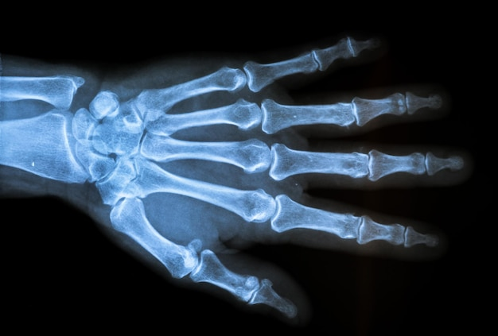 | 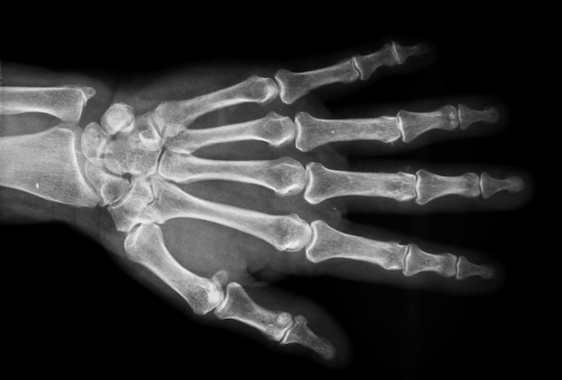 |
|  |  |
| 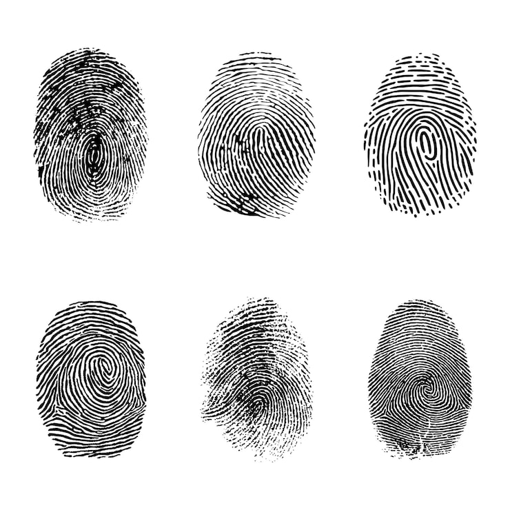 |  |
| 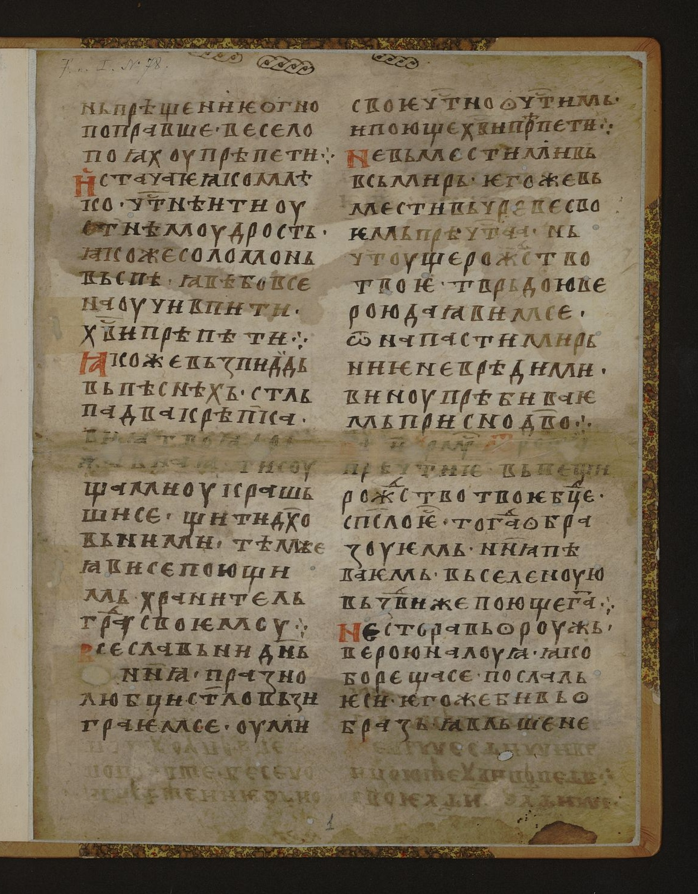 |  |

## Задание 2. Адаптивная бинаризация Айквиль (3×3)

### Описание алгоритма

1. Изображение сканируется двумя конгруэнтными окнами:
   - малым r размером S × S (по варианту **S = 3**);
   - большим R размером L × L (**L = 15**).
   
   Оба окна накладываются на одну и ту же область, шаг сканирования равен стороне малого окна (3 пикселя). Большое окно используется для анализа (по нему считается статистика), а само бинарное решение принимается для пикселей малого окна.

2. Для большого окна R методом Отсу вычисляется оптимальный порог T, разделяющий пиксели на два кластера:
   - тёмный (пиксели ≤ T), среднее M₀;
   - светлый (пиксели > T), среднее M₁.

3. Если контраст в большом окне достаточный:
   $$|M_1 - M_0| \geq 15$$
   то пиксели малого окна бинаризуются по порогу T

4. Иначе яркость пикселей из малого окна заменяется на яркость класса с наиболее близким значением M.

### Результаты бинаризации

| Изображение | Полутоновое | Бинарное |
|---|---|---|
| Контурная карта |  | 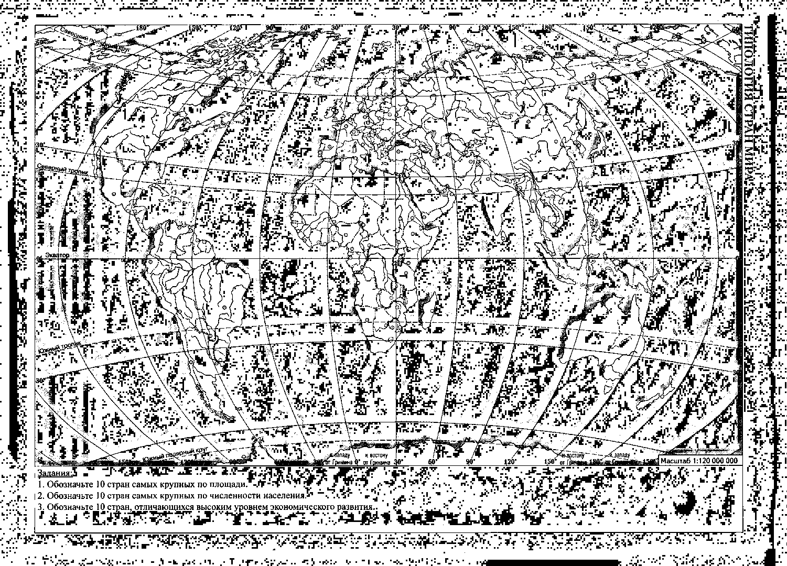 |
| Рентген |  | 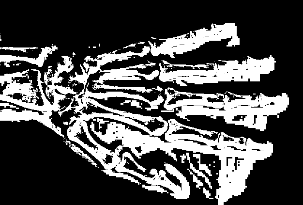 |
| Мультфильм |  | 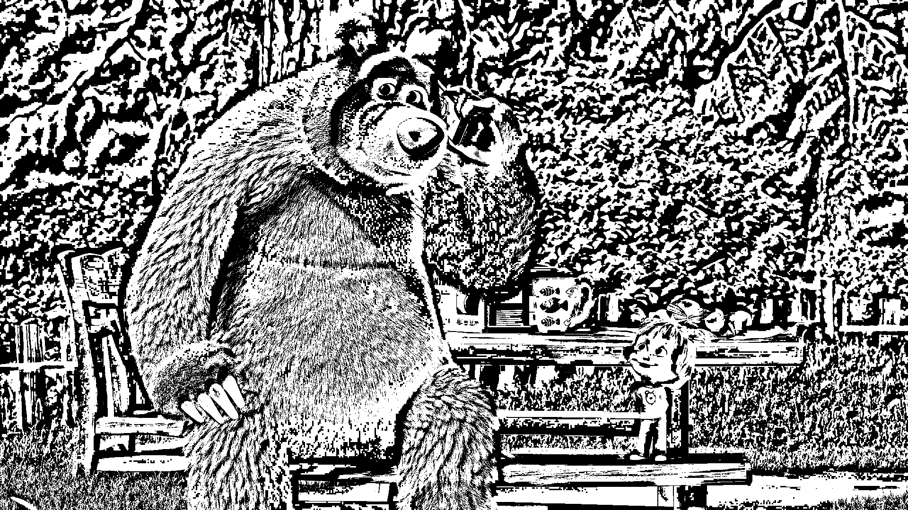 |
| Отпечаток пальца |  | 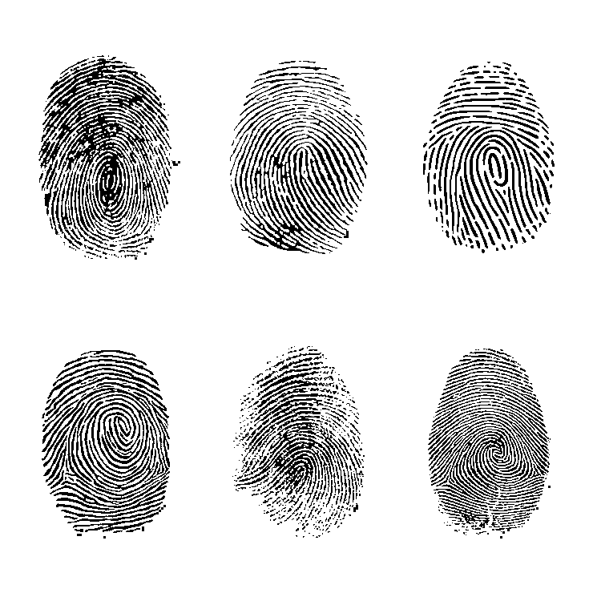 |
| Страница текста |  | 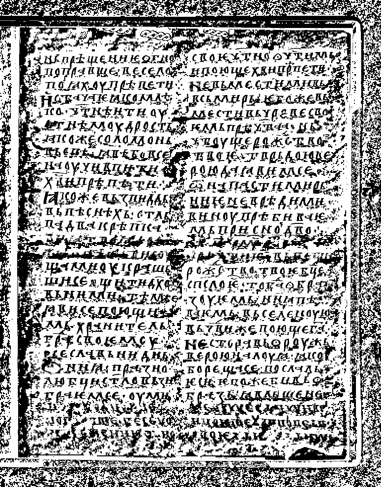 |

## Вывод

Метод Айквиль в целом справляется с задачей: четко выделяет линии на контурной карте, контуры объектов в мультфильме и папиллярные линии на отпечатке пальца. За счёт проверки контраста в окне в однородных областях не появляется ложного шума.

Вместе с тем заметны ограничения метода:
- на странице текста буквы немного размазались - из-за окна 3×3 алгоритм слишком чувствителен к локальным переходам яркости на границах символов;
- на рентгеновском снимке линии и анатомические границы существенно смазались - мягкие переходы плохо поддаются жесткой бинаризации, и метод теряет часть деталей.