# Лабораторная работа №2  
## Обесцвечивание и бинаризация растровых изображений
### Вариант 5 - адаптивная бинаризация Эйквил, окно 3х3, 5х5

---

### Перевод в полутоновое изображение

Яркость пикселя вычисляется как взвешенное среднее значений цветовых каналов:

\[
Y = 0.299R + 0.587G + 0.114B
\]

где:
- \(R\), \(G\), \(B\) — значения красного, зелёного и синего каналов соответственно.

---

### Бинаризация

Для каждого пикселя вычисляется среднее значение яркости в локальном окнем.

Далее применяется правило:
- если значение пикселя больше среднего - пиксель становится белым (255)
- иначе - чёрным (0)

---

## Ход работы

Обработка выполнялась для 5 изображений.

---

## Изображение 1

### Перевод в полутон

**Оригинал - Полутон:**

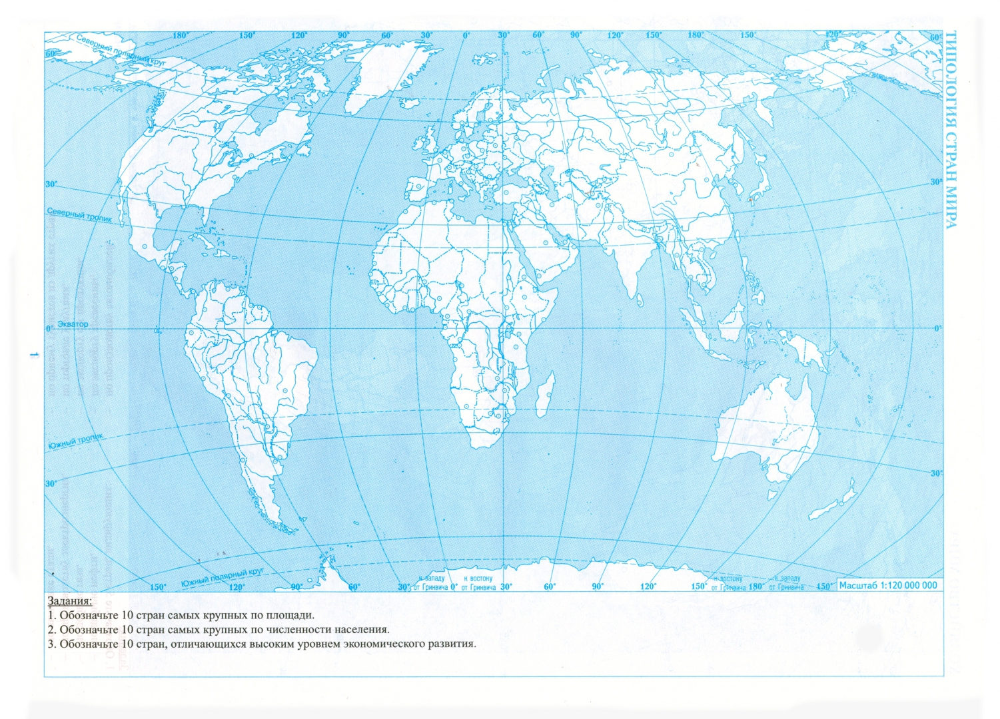

---

### Бинаризация

**Полутон - Бинаризация 3×3 - Бинаризация 5×5:**

---

## Изображение 2

### Перевод в полутон

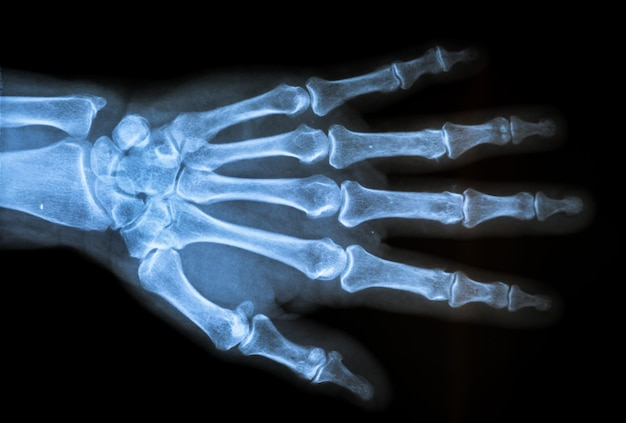
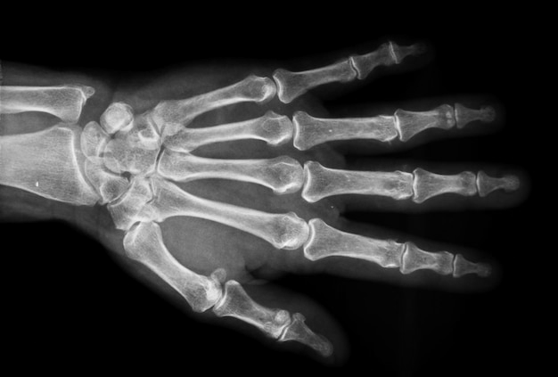

---

### Бинаризация

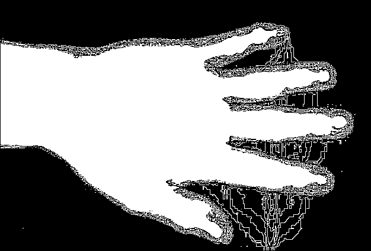
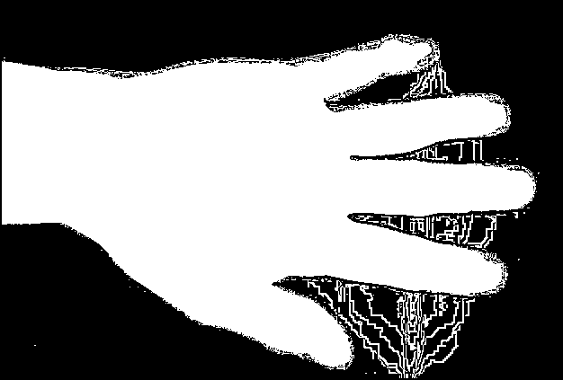

---

## Изображение 3

### Перевод в полутон

---

### Бинаризация

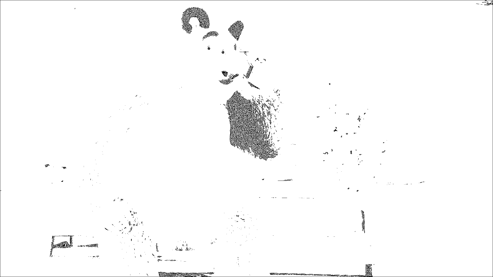
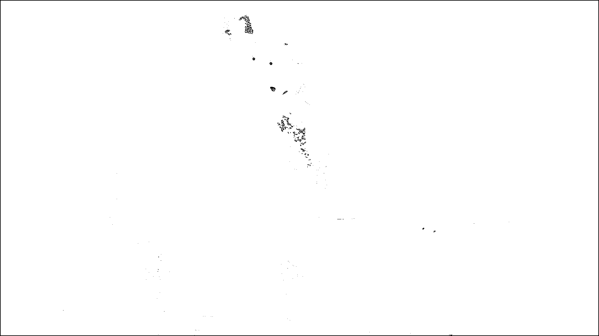

---

## Изображение 4

### Перевод в полутон

---

### Бинаризация

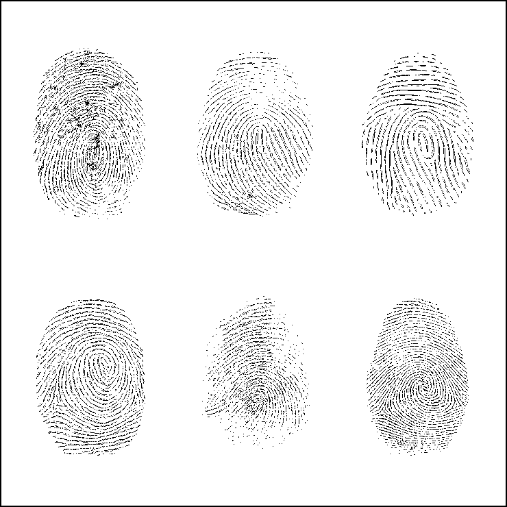

---

## Изображение 5

### Перевод в полутон

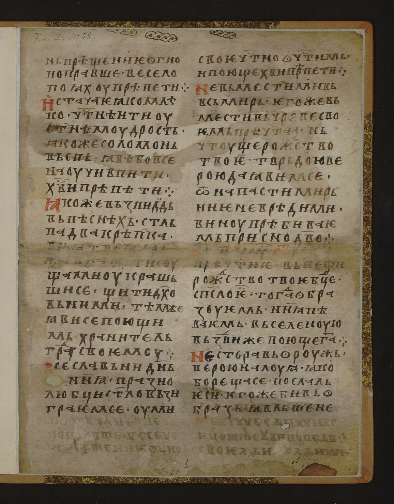
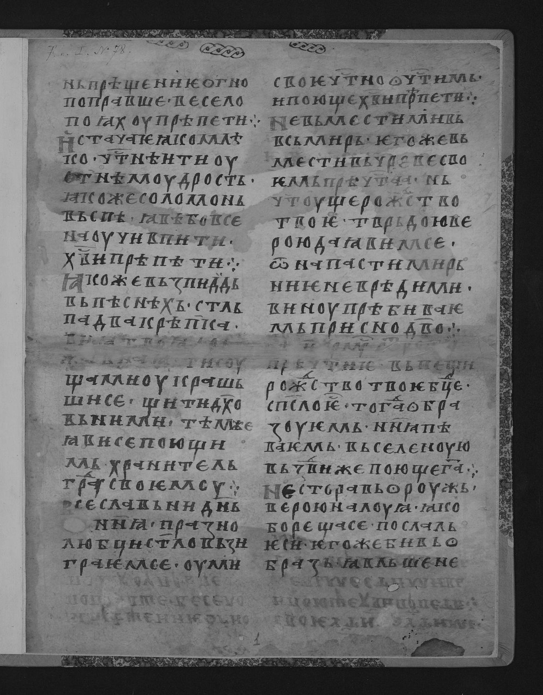

---

### Бинаризация

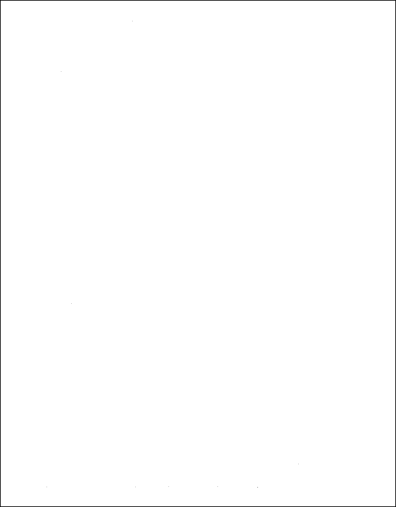

---

## Анализ результатов

Сравнение окон:
- Окно 3×3:
  - лучше сохраняет мелкие детали  
  - но чувствительно к шуму  

- Окно 5×5:
  - в случае используемого метода бинаризации теряет детали изображения

---

