# Лабораторная работа №3  
## Фильтрация изображений и морфологические операции
### Вариант 5 - Медианный фильтр, маска - прямой крест, ранг 3/5

---

### Разностное изображение

Для полутоновых изображений используется модуль разности:

\[
D = |I - I_f|
\]

где:
- \(I\) — исходное изображение  
- \(I_f\) — отфильтрованное  

Для повышения видимости результат контрастирован (x10).

---

## Ход работы

---

### Изображение 1

**Оригинал:**

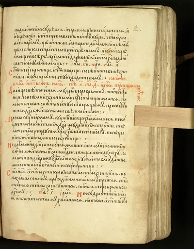

**Полутон:**

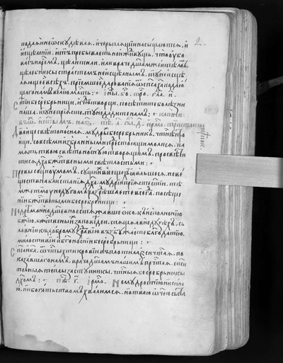

**Фильтр:**

**Разностное:**

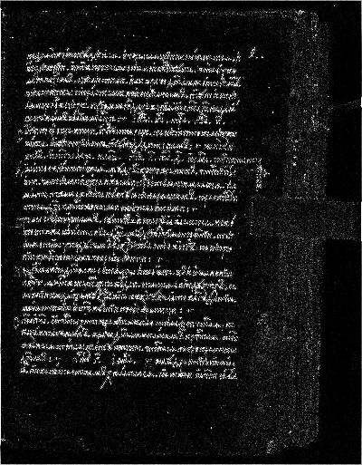

---

### Изображение 2

**Оригинал:**

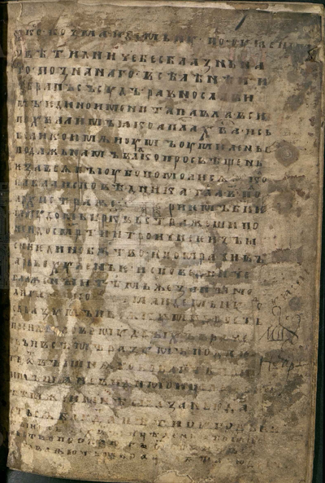

**Полутон:**

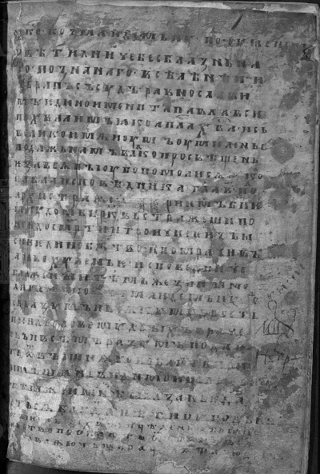

**Фильтр:**

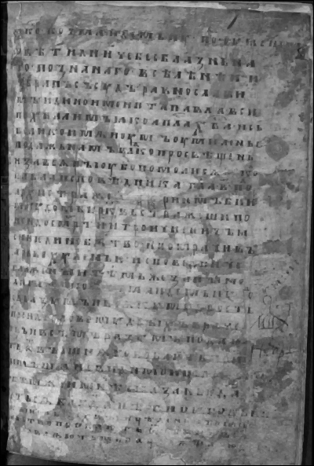

**Разностное:**

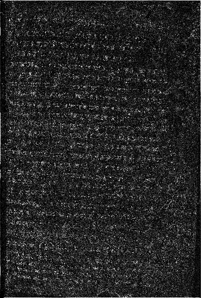

---

### Изображение 3

**Оригинал:**

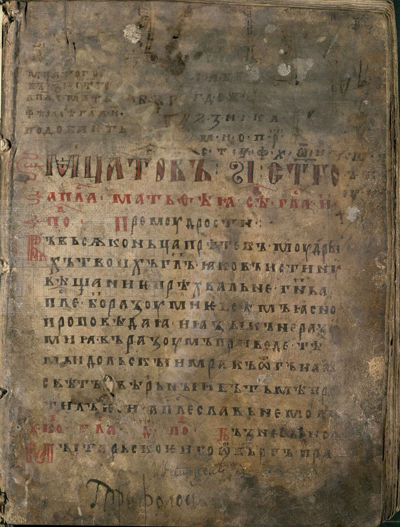

**Полутон:**

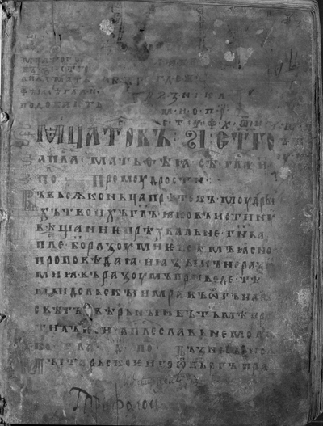

**Фильтр:**

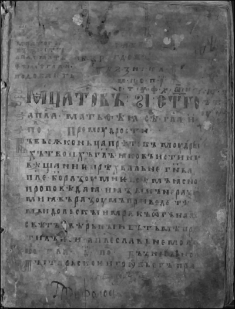

**Разностное:**

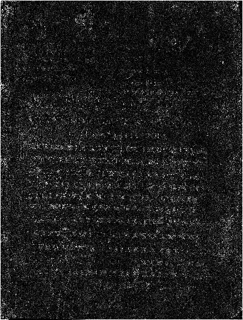

