# Лабораторная работа №5. Выделение признаков символов

Вариант 5: Кириллица, строчные буквы - абвгдежѕзиiклмнопрстуфхцчшщъыьѣюѵѯѱѡѳѧѫ

Шрифт: Times New Roman, кегль 52.

Для каждой буквы алфавита создается отдельное черно-белое растровое изображение. Каждый символ сохраняется в отдельный PNG-файл в папке symbols.
Для каждого изображения вычисляется набор числовых признаков, описывающих форму символа.

## Результаты

Все скалярные признаки сведены в таблицу features.csv. Профили сохранены в виде столбчатых диаграмм PNG в папке profiles/ с правильной ориентацией осей и целочисленными подписями.

---

## Результаты по каждому символу

### 1. Символ «а»

**Скалярные признаки:**

| Признак | Значение |
|---|---|
| Вес верхней левой четверти | 38 |
| Вес верхней правой четверти | 51 |
| Вес нижней левой четверти | 59 |
| Вес нижней правой четверти | 61 |
| Удельный вес верхней левой | 0.3455 |
| Удельный вес верхней правой | 0.4215 |
| Удельный вес нижней левой | 0.4917 |
| Удельный вес нижней правой | 0.4621 |
| Центр тяжести X | 9.4402 |
| Центр тяжести Y | 11.9139 |
| Норм. центр тяжести X | 0.4495 |
| Норм. центр тяжести Y | 0.5180 |
| Момент инерции X | 10278.45 |
| Момент инерции Y | 6569.50 |
| Норм. момент инерции X | 21.2804 |
| Норм. момент инерции Y | 13.6015 |

**Профили:**

| Профиль X | Профиль Y |
|---|---|
| 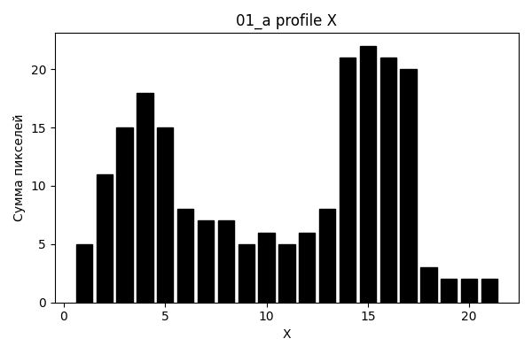 | 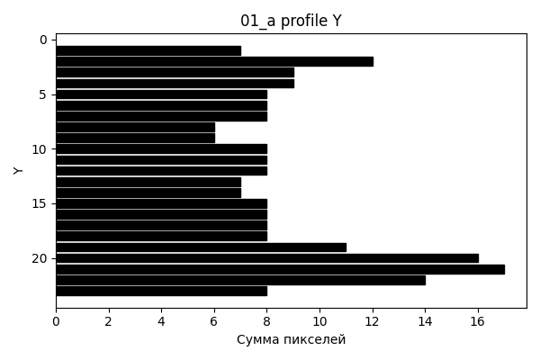 |

---

### 2. Символ «б»

**Скалярные признаки:**

| Признак | Значение |
|---|---|
| Вес верхней левой четверти | 65 |
| Вес верхней правой четверти | 71 |
| Вес нижней левой четверти | 87 |
| Вес нижней правой четверти | 78 |
| Удельный вес верхней левой | 0.3283 |
| Удельный вес верхней правой | 0.3287 |
| Удельный вес нижней левой | 0.4394 |
| Удельный вес нижней правой | 0.3611 |
| Центр тяжести X | 10.5482 |
| Центр тяжести Y | 17.9635 |
| Норм. центр тяжести X | 0.4586 |
| Норм. центр тяжести Y | 0.4990 |
| Момент инерции X | 33086.60 |
| Момент инерции Y | 14702.55 |
| Норм. момент инерции X | 39.9597 |
| Норм. момент инерции Y | 17.7567 |

**Профили:**

| Профиль X | Профиль Y |
|---|---|
| 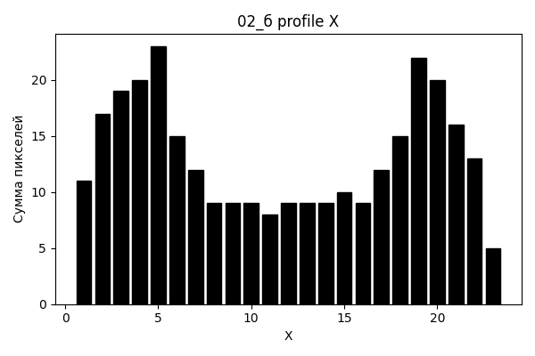 | 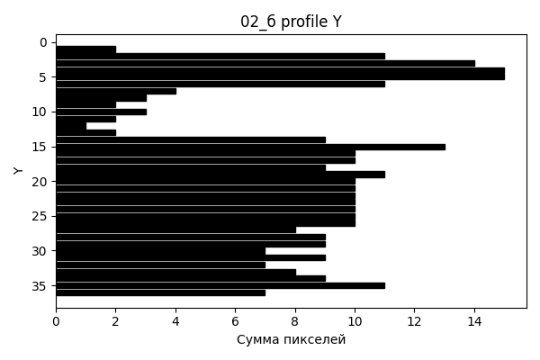 |

---

### 3. Символ «в»

**Скалярные признаки:**

| Признак | Значение |
|---|---|
| Вес верхней левой четверти | 59 |
| Вес верхней правой четверти | 53 |
| Вес нижней левой четверти | 63 |
| Вес нижней правой четверти | 66 |
| Удельный вес верхней левой | 0.4876 |
| Удельный вес верхней правой | 0.4380 |
| Удельный вес нижней левой | 0.4773 |
| Удельный вес нижней правой | 0.5000 |
| Центр тяжести X | 10.9087 |
| Центр тяжести Y | 11.1203 |
| Норм. центр тяжести X | 0.4959 |
| Норм. центр тяжести Y | 0.4835 |
| Момент инерции X | 12145.51 |
| Момент инерции Y | 8031.99 |
| Норм. момент инерции X | 24.0030 |
| Норм. момент инерции Y | 15.8735 |

**Профили:**

| Профиль X | Профиль Y |
|---|---|
| 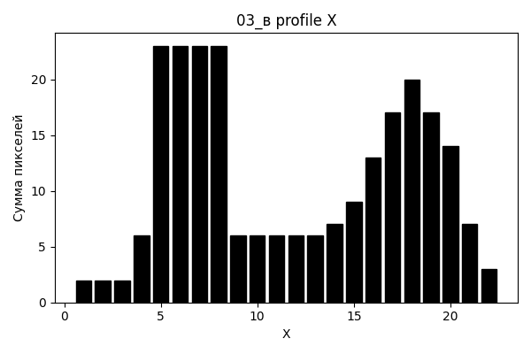 | 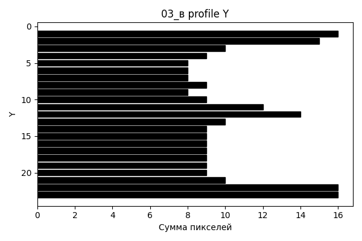 |

---

### 4. Символ «г»

**Скалярные признаки:**

| Признак | Значение |
|---|---|
| Вес верхней левой четверти | 54 |
| Вес верхней правой четверти | 25 |
| Вес нижней левой четверти | 57 |
| Вес нижней правой четверти | 1 |
| Удельный вес верхней левой | 0.4909 |
| Удельный вес верхней правой | 0.2273 |
| Удельный вес нижней левой | 0.4750 |
| Удельный вес нижней правой | 0.0083 |
| Центр тяжести X | 7.1460 |
| Центр тяжести Y | 9.2336 |
| Норм. центр тяжести X | 0.3573 |
| Норм. центр тяжести Y | 0.4015 |
| Момент инерции X | 8268.53 |
| Момент инерции Y | 2557.08 |
| Норм. момент инерции X | 17.9751 |
| Норм. момент инерции Y | 5.5589 |

**Профили:**

| Профиль X | Профиль Y |
|---|---|
| 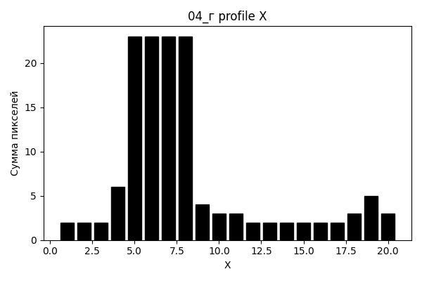 | 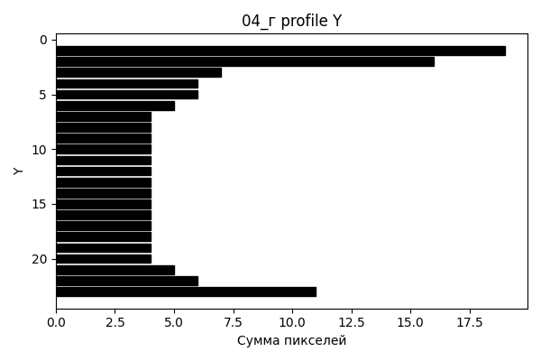 |

---

### 5. Символ «д»

**Скалярные признаки:**

| Признак | Значение |
|---|---|
| Вес верхней левой четверти | 32 |
| Вес верхней правой четверти | 70 |
| Вес нижней левой четверти | 47 |
| Вес нижней правой четверти | 64 |
| Удельный вес верхней левой | 0.1905 |
| Удельный вес верхней правой | 0.4167 |
| Удельный вес нижней левой | 0.2611 |
| Удельный вес нижней правой | 0.3556 |
| Центр тяжести X | 13.6901 |
| Центр тяжести Y | 13.1080 |
| Норм. центр тяжести X | 0.5704 |
| Норм. центр тяжести Y | 0.4520 |
| Момент инерции X | 15948.52 |
| Момент инерции Y | 9371.55 |
| Норм. момент инерции X | 22.9145 |
| Норм. момент инерции Y | 13.4649 |

**Профили:**

| Профиль X | Профиль Y |
|---|---|
| 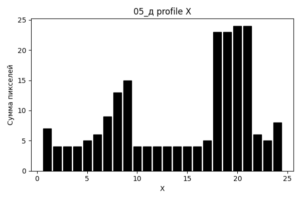 | 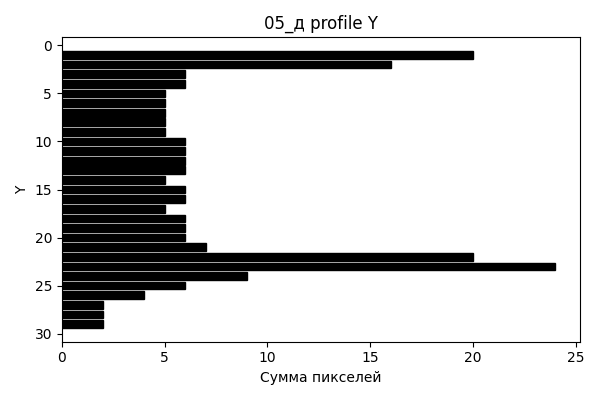 |

---

### 6. Символ «е»

**Скалярные признаки:**

| Признак | Значение |
|---|---|
| Вес верхней левой четверти | 47 |
| Вес верхней правой четверти | 54 |
| Вес нижней левой четверти | 65 |
| Вес нижней правой четверти | 31 |
| Удельный вес верхней левой | 0.4273 |
| Удельный вес верхней правой | 0.4909 |
| Удельный вес нижней левой | 0.5417 |
| Удельный вес нижней правой | 0.2583 |
| Центр тяжести X | 8.4873 |
| Центр тяжести Y | 11.1878 |
| Норм. центр тяжести X | 0.4244 |
| Норм. центр тяжести Y | 0.4864 |
| Момент инерции X | 9200.05 |
| Момент инерции Y | 6131.22 |
| Норм. момент инерции X | 20.0001 |
| Норм. момент инерции Y | 13.3287 |

**Профили:**

| Профиль X | Профиль Y |
|---|---|
| 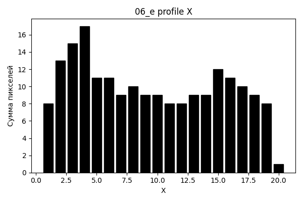 | 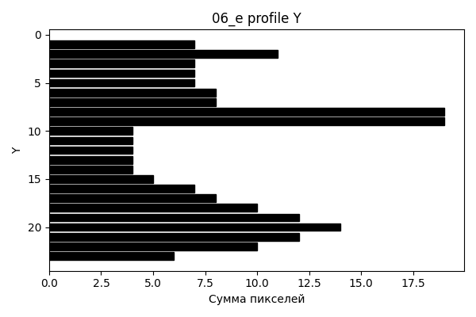 |

---

### 7. Символ «ж»

**Скалярные признаки:**

| Признак | Значение |
|---|---|
| Вес верхней левой четверти | 72 |
| Вес верхней правой четверти | 71 |
| Вес нижней левой четверти | 93 |
| Вес нижней правой четверти | 93 |
| Удельный вес верхней левой | 0.3850 |
| Удельный вес верхней правой | 0.3797 |
| Удельный вес нижней левой | 0.4559 |
| Удельный вес нижней правой | 0.4559 |
| Центр тяжести X | 16.4073 |
| Центр тяжести Y | 11.2857 |
| Норм. центр тяжести X | 0.4826 |
| Норм. центр тяжести Y | 0.4907 |
| Момент инерции X | 17739.14 |
| Момент инерции Y | 24221.42 |
| Норм. момент инерции X | 22.6843 |
| Норм. момент инерции Y | 30.9737 |

**Профили:**

| Профиль X | Профиль Y |
|---|---|
| 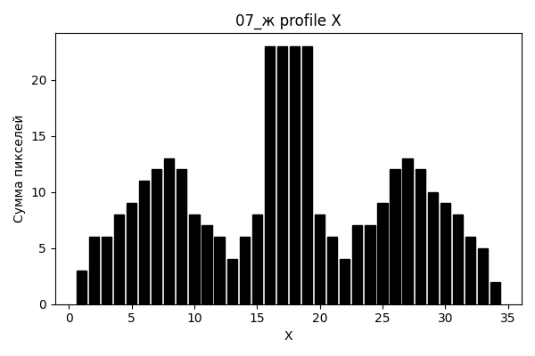 | 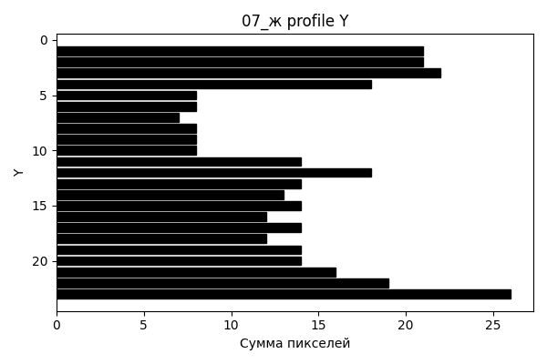 |

---

### 8. Символ «ѕ»

**Скалярные признаки:**

| Признак | Значение |
|---|---|
| Вес верхней левой четверти | 44 |
| Вес верхней правой четверти | 29 |
| Вес нижней левой четверти | 31 |
| Вес нижней правой четверти | 57 |
| Удельный вес верхней левой | 0.5714 |
| Удельный вес верхней правой | 0.3295 |
| Удельный вес нижней левой | 0.3690 |
| Удельный вес нижней правой | 0.5938 |
| Центр тяжести X | 6.9503 |
| Центр тяжести Y | 11.2919 |
| Норм. центр тяжести X | 0.4634 |
| Норм. центр тяжести Y | 0.4910 |
| Момент инерции X | 8011.28 |
| Момент инерции Y | 3339.60 |
| Норм. момент инерции X | 23.2211 |
| Норм. момент инерции Y | 9.6800 |

**Профили:**

| Профиль X | Профиль Y |
|---|---|
| 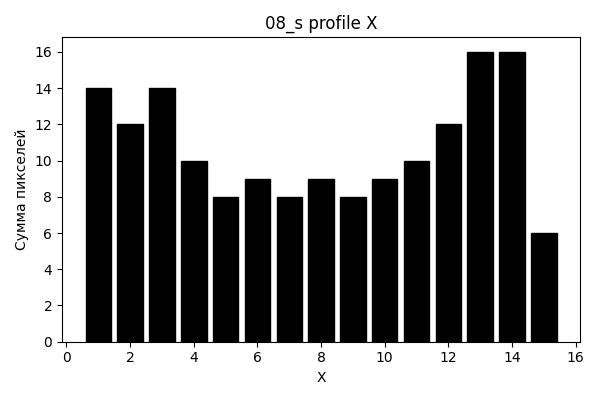 | 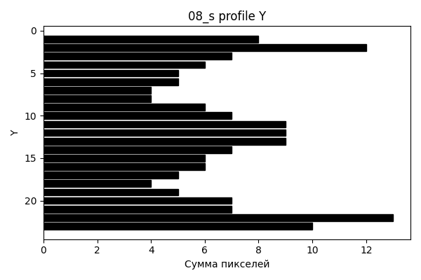 |

---

### 9. Символ «з»

**Скалярные признаки:**

| Признак | Значение |
|---|---|
| Вес верхней левой четверти | 30 |
| Вес верхней правой четверти | 49 |
| Вес нижней левой четверти | 16 |
| Вес нижней правой четверти | 58 |
| Удельный вес верхней левой | 0.3030 |
| Удельный вес верхней правой | 0.4949 |
| Удельный вес нижней левой | 0.1481 |
| Удельный вес нижней правой | 0.5370 |
| Центр тяжести X | 10.3464 |
| Центр тяжести Y | 10.2941 |
| Норм. центр тяжести X | 0.5748 |
| Норм. центр тяжести Y | 0.4476 |
| Момент инерции X | 8471.76 |
| Момент инерции Y | 3300.64 |
| Норм. момент инерции X | 20.4632 |
| Норм. момент инерции Y | 7.9726 |

**Профили:**

| Профиль X | Профиль Y |
|---|---|
| 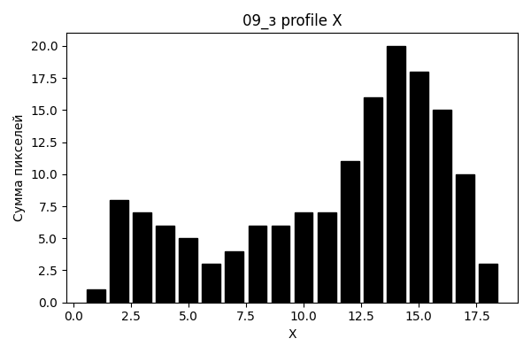 | 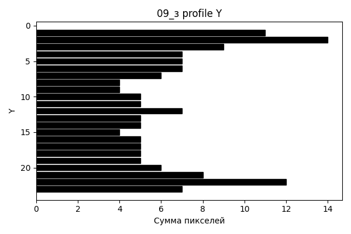 |

---

### 10. Символ «и»

**Скалярные признаки:**

| Признак | Значение |
|---|---|
| Вес верхней левой четверти | 54 |
| Вес верхней правой четверти | 64 |
| Вес нижней левой четверти | 69 |
| Вес нижней правой четверти | 59 |
| Удельный вес верхней левой | 0.3776 |
| Удельный вес верхней правой | 0.4476 |
| Удельный вес нижней левой | 0.4423 |
| Удельный вес нижней правой | 0.3782 |
| Центр тяжести X | 12.4268 |
| Центр тяжести Y | 11.0244 |
| Норм. центр тяжести X | 0.4780 |
| Норм. центр тяжести Y | 0.4793 |
| Момент инерции X | 12833.85 |
| Момент инерции Y | 12174.18 |
| Норм. момент инерции X | 21.4613 |
| Норм. момент инерции Y | 20.3582 |

**Профили:**

| Профиль X | Профиль Y |
|---|---|
| 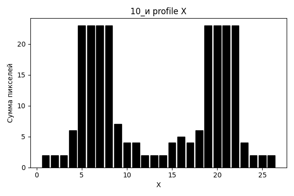 | 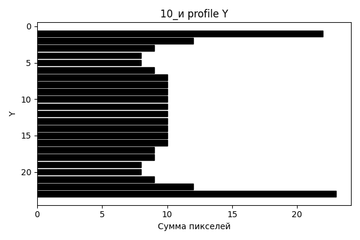 |

---

### 11. Символ «i»

**Скалярные признаки:**

| Признак | Значение |
|---|---|
| Вес верхней левой четверти | 20 |
| Вес верхней правой четверти | 28 |
| Вес нижней левой четверти | 40 |
| Вес нижней правой четверти | 58 |
| Удельный вес верхней левой | 0.2222 |
| Удельный вес верхней правой | 0.2593 |
| Удельный вес нижней левой | 0.4444 |
| Удельный вес нижней правой | 0.5370 |
| Центр тяжести X | 4.9178 |
| Центр тяжести Y | 21.3356 |
| Норм. центр тяжести X | 0.4471 |
| Норм. центр тяжести Y | 0.5927 |
| Момент инерции X | 15212.55 |
| Момент инерции Y | 435.01 |
| Норм. момент инерции X | 38.4155 |
| Норм. момент инерции Y | 1.0985 |

**Профили:**

| Профиль X | Профиль Y |
|---|---|
| 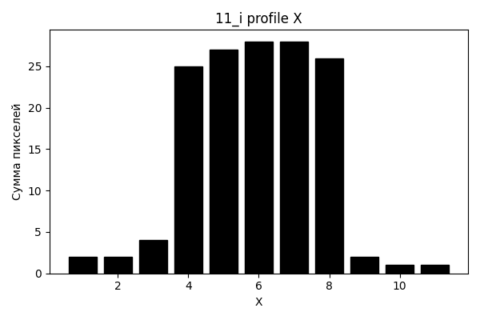 | 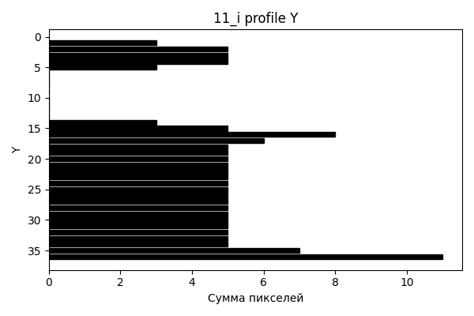 |

---

### 12. Символ «к»

**Скалярные признаки:**

| Признак | Значение |
|---|---|
| Вес верхней левой четверти | 60 |
| Вес верхней правой четверти | 38 |
| Вес нижней левой четверти | 65 |
| Вес нижней правой четверти | 59 |
| Удельный вес верхней левой | 0.4545 |
| Удельный вес верхней правой | 0.2879 |
| Удельный вес нижней левой | 0.4514 |
| Удельный вес нижней правой | 0.4097 |
| Центр тяжести X | 10.4730 |
| Центр тяжести Y | 11.3243 |
| Норм. центр тяжести X | 0.4364 |
| Норм. центр тяжести Y | 0.4924 |
| Момент инерции X | 12016.65 |
| Момент инерции Y | 7553.34 |
| Норм. момент инерции X | 21.7693 |
| Норм. момент инерции Y | 13.6836 |

**Профили:**

| Профиль X | Профиль Y |
|---|---|
| 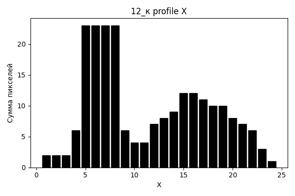 | 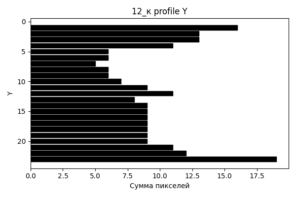 |

---

### 13. Символ «л»

**Скалярные признаки:**

| Признак | Значение |
|---|---|
| Вес верхней левой четверти | 27 |
| Вес верхней правой четверти | 60 |
| Вес нижней левой четверти | 42 |
| Вес нижней правой четверти | 59 |
| Удельный вес верхней левой | 0.2045 |
| Удельный вес верхней правой | 0.4196 |
| Удельный вес нижней левой | 0.2917 |
| Удельный вес нижней правой | 0.3782 |
| Центр тяжести X | 13.8191 |
| Центр тяжести Y | 11.1649 |
| Норм. центр тяжести X | 0.5528 |
| Норм. центр тяжести Y | 0.4854 |
| Момент инерции X | 11759.89 |
| Момент инерции Y | 7629.85 |
| Норм. момент инерции X | 20.4520 |
| Норм. момент инерции Y | 13.2693 |

**Профили:**

| Профиль X | Профиль Y |
|---|---|
| 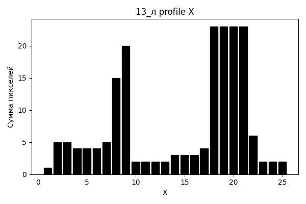 | 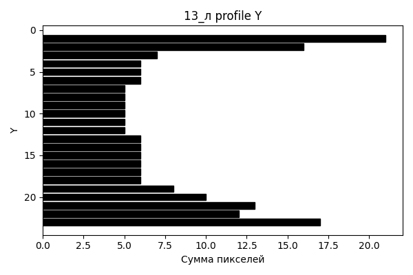 |

---

### 14. Символ «м»

**Скалярные признаки:**

| Признак | Значение |
|---|---|
| Вес верхней левой четверти | 72 |
| Вес верхней правой четверти | 65 |
| Вес нижней левой четверти | 74 |
| Вес нижней правой четверти | 74 |
| Удельный вес верхней левой | 0.4364 |
| Удельный вес верхней правой | 0.3693 |
| Удельный вес нижней левой | 0.4111 |
| Удельный вес нижней правой | 0.3854 |
| Центр тяжести X | 15.2351 |
| Центр тяжести Y | 11.0351 |
| Норм. центр тяжести X | 0.4915 |
| Норм. центр тяжести Y | 0.4798 |
| Момент инерции X | 13407.65 |
| Момент инерции Y | 20725.25 |
| Норм. момент инерции X | 18.8046 |
| Норм. момент инерции Y | 29.0677 |

**Профили:**

| Профиль X | Профиль Y |
|---|---|
| 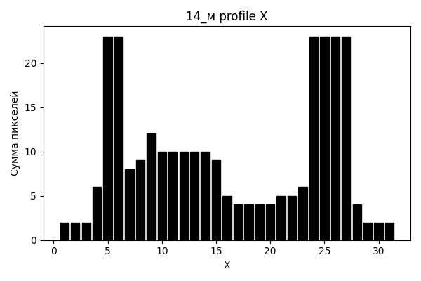 | 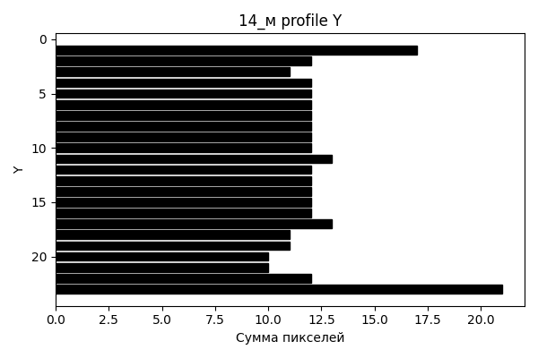 |

---

### 15. Символ «н»

**Скалярные признаки:**

| Признак | Значение |
|---|---|
| Вес верхней левой четверти | 59 |
| Вес верхней правой четверти | 59 |
| Вес нижней левой четверти | 63 |
| Вес нижней правой четверти | 63 |
| Удельный вес верхней левой | 0.4126 |
| Удельный вес верхней правой | 0.4126 |
| Удельный вес нижней левой | 0.4038 |
| Удельный вес нижней правой | 0.4038 |
| Центр тяжести X | 12.4344 |
| Центр тяжести Y | 10.9590 |
| Норм. центр тяжести X | 0.4782 |
| Норм. центр тяжести Y | 0.4765 |
| Момент инерции X | 12697.59 |
| Момент инерции Y | 12147.95 |
| Норм. момент инерции X | 21.2334 |
| Норм. момент инерции Y | 20.3143 |

**Профили:**

| Профиль X | Профиль Y |
|---|---|
|  | 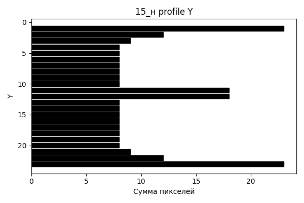 |

---

### 16. Символ «о»

**Скалярные признаки:**

| Признак | Значение |
|---|---|
| Вес верхней левой четверти | 46 |
| Вес верхней правой четверти | 54 |
| Вес нижней левой четверти | 60 |
| Вес нижней правой четверти | 50 |
| Удельный вес верхней левой | 0.3802 |
| Удельный вес верхней правой | 0.4463 |
| Удельный вес нижней левой | 0.4545 |
| Удельный вес нижней правой | 0.3788 |
| Центр тяжести X | 10.4524 |
| Центр тяжести Y | 10.9905 |
| Норм. центр тяжести X | 0.4751 |
| Норм. центр тяжести Y | 0.4778 |
| Момент инерции X | 8881.98 |
| Момент инерции Y | 10716.02 |
| Норм. момент инерции X | 17.5533 |
| Норм. момент инерции Y | 21.1779 |

**Профили:**

| Профиль X | Профиль Y |
|---|---|
| 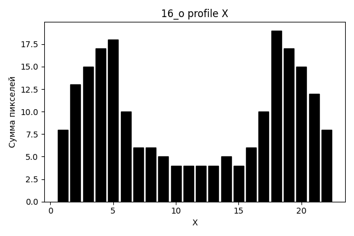 | 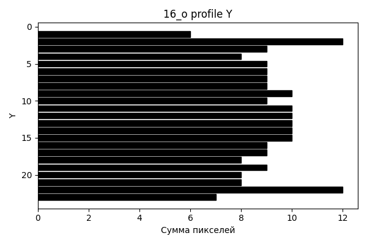 |

---

### 17. Символ «п»

**Скалярные признаки:**

| Признак | Значение |
|---|---|
| Вес верхней левой четверти | 60 |
| Вес верхней правой четверти | 59 |
| Вес нижней левой четверти | 58 |
| Вес нижней правой четверти | 58 |
| Удельный вес верхней левой | 0.4196 |
| Удельный вес верхней правой | 0.4126 |
| Удельный вес нижней левой | 0.3718 |
| Удельный вес нижней правой | 0.3718 |
| Центр тяжести X | 12.4255 |
| Центр тяжести Y | 10.5191 |
| Норм. центр тяжести X | 0.4779 |
| Норм. центр тяжести Y | 0.4574 |
| Момент инерции X | 13796.66 |
| Момент инерции Y | 12027.45 |
| Норм. момент инерции X | 23.0713 |
| Норм. момент инерции Y | 20.1128 |

**Профили:**

| Профиль X | Профиль Y |
|---|---|
| 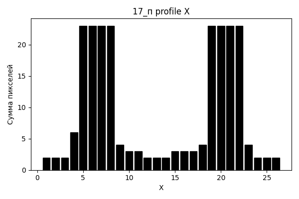 | 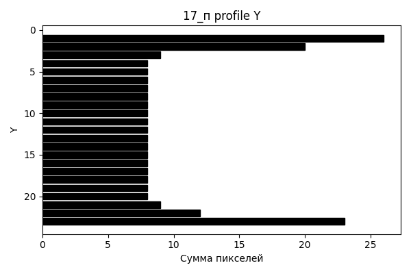 |

---

### 18. Символ «р»

**Скалярные признаки:**

| Признак | Значение |
|---|---|
| Вес верхней левой четверти | 79 |
| Вес верхней правой четверти | 94 |
| Вес нижней левой четверти | 85 |
| Вес нижней правой четверти | 26 |
| Удельный вес верхней левой | 0.3873 |
| Удельный вес верхней правой | 0.4608 |
| Удельный вес нижней левой | 0.4167 |
| Удельный вес нижней правой | 0.1275 |
| Центр тяжести X | 11.2218 |
| Центр тяжести Y | 13.7218 |
| Норм. центр тяжести X | 0.4676 |
| Норм. центр тяжести Y | 0.4036 |
| Момент инерции X | 27137.02 |
| Момент инерции Y | 13197.02 |
| Норм. момент инерции X | 33.2562 |
| Норм. момент инерции Y | 16.1728 |

**Профили:**

| Профиль X | Профиль Y |
|---|---|
| 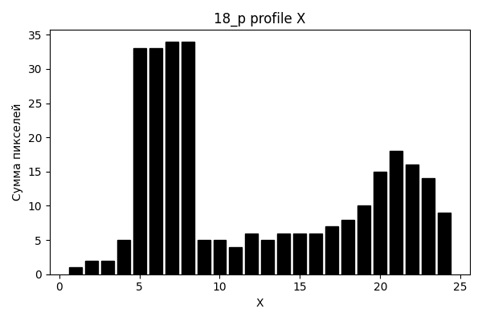 | 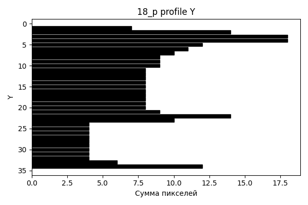 |

---

### 19. Символ «с»

**Скалярные признаки:**

| Признак | Значение |
|---|---|
| Вес верхней левой четверти | 37 |
| Вес верхней правой четверти | 34 |
| Вес нижней левой четверти | 61 |
| Вес нижней правой четверти | 35 |
| Удельный вес верхней левой | 0.3737 |
| Удельный вес верхней правой | 0.3091 |
| Удельный вес нижней левой | 0.5648 |
| Удельный вес нижней правой | 0.2917 |
| Центр тяжести X | 7.6527 |
| Центр тяжести Y | 11.8383 |
| Норм. центр тяжести X | 0.4028 |
| Норм. центр тяжести Y | 0.5147 |
| Момент инерции X | 8704.63 |
| Момент инерции Y | 5233.86 |
| Норм. момент инерции X | 19.9191 |
| Норм. момент инерции Y | 11.9768 |

**Профили:**

| Профиль X | Профиль Y |
|---|---|
| 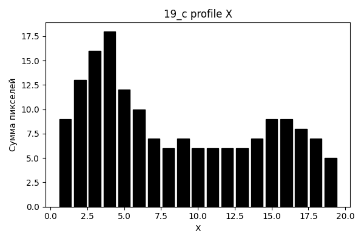 | 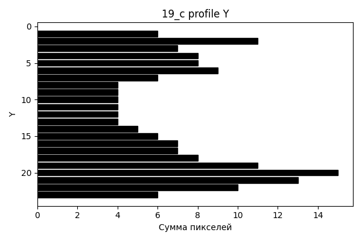 |

---

### 20. Символ «т»

**Скалярные признаки:**

| Признак | Значение |
|---|---|
| Вес верхней левой четверти | 44 |
| Вес верхней правой четверти | 46 |
| Вес нижней левой четверти | 29 |
| Вес нижней правой четверти | 32 |
| Удельный вес верхней левой | 0.3636 |
| Удельный вес верхней правой | 0.3802 |
| Удельный вес нижней левой | 0.2197 |
| Удельный вес нижней правой | 0.2424 |
| Центр тяжести X | 10.7285 |
| Центр тяжести Y | 8.9404 |
| Норм. центр тяжести X | 0.4877 |
| Норм. центр тяжести Y | 0.3887 |
| Момент инерции X | 9280.46 |
| Момент инерции Y | 2979.87 |
| Норм. момент инерции X | 18.3408 |
| Норм. момент инерции Y | 5.8891 |

**Профили:**

| Профиль X | Профиль Y |
|---|---|
| 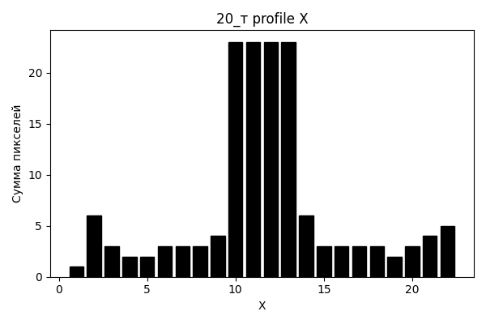 | 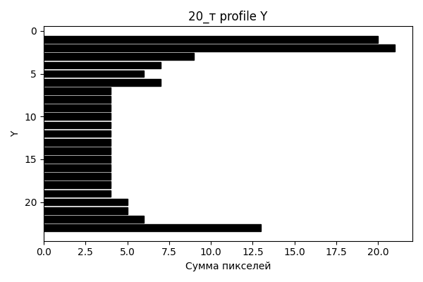 |

---

### 21. Символ «у»

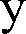

**Скалярные признаки:**

| Признак | Значение |
|---|---|
| Вес верхней левой четверти | 82 |
| Вес верхней правой четверти | 52 |
| Вес нижней левой четверти | 54 |
| Вес нижней правой четверти | 20 |
| Удельный вес верхней левой | 0.3710 |
| Удельный вес верхней правой | 0.2353 |
| Удельный вес нижней левой | 0.2443 |
| Удельный вес нижней правой | 0.0905 |
| Центр тяжести X | 10.9279 |
| Центр тяжести Y | 13.8029 |
| Норм. центр тяжести X | 0.4203 |
| Норм. центр тяжести Y | 0.4060 |
| Момент инерции X | 23060.92 |
| Момент инерции Y | 6669.92 |
| Норм. момент инерции X | 26.0870 |
| Норм. момент инерции Y | 7.5452 |

**Профили:**

| Профиль X | Профиль Y |
|---|---|
| 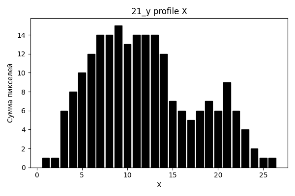 | 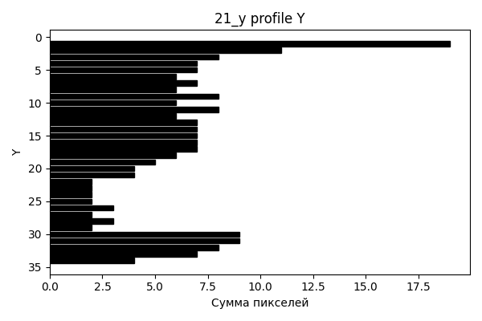 |

---

### 22. Символ «ф»

**Скалярные признаки:**

| Признак | Значение |
|---|---|
| Вес верхней левой четверти | 80 |
| Вес верхней правой четверти | 113 |
| Вес нижней левой четверти | 93 |
| Вес нижней правой четверти | 134 |
| Удельный вес верхней левой | 0.2484 |
| Удельный вес верхней правой | 0.3275 |
| Удельный вес нижней левой | 0.2768 |
| Удельный вес нижней правой | 0.3722 |
| Центр тяжести X | 14.1024 |
| Центр тяжести Y | 23.7833 |
| Норм. центр тяжести X | 0.4863 |
| Норм. центр тяжести Y | 0.5060 |
| Момент инерции X | 53279.28 |
| Момент инерции Y | 24308.60 |
| Норм. момент инерции X | 39.0897 |
| Норм. момент инерции Y | 17.8346 |

**Профили:**

| Профиль X | Профиль Y |
|---|---|
| 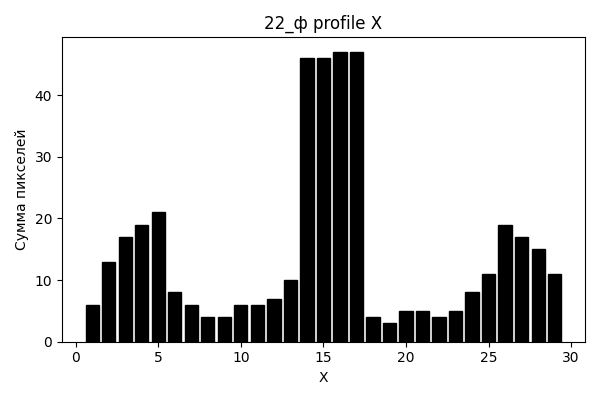 | 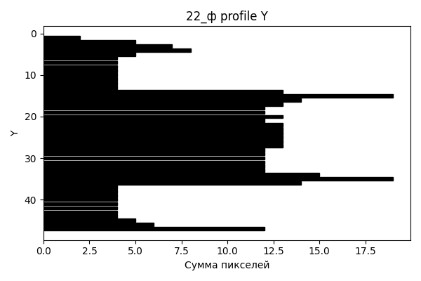 |

---

### 23. Символ «х»

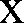

**Скалярные признаки:**

| Признак | Значение |
|---|---|
| Вес верхней левой четверти | 61 |
| Вес верхней правой четверти | 33 |
| Вес нижней левой четверти | 38 |
| Вес нижней правой четверти | 63 |
| Удельный вес верхней левой | 0.4621 |
| Удельный вес верхней правой | 0.2500 |
| Удельный вес нижней левой | 0.2639 |
| Удельный вес нижней правой | 0.4375 |
| Центр тяжести X | 11.0821 |
| Центр тяжести Y | 10.9077 |
| Норм. центр тяжести X | 0.4618 |
| Норм. центр тяжести Y | 0.4742 |
| Момент инерции X | 11284.34 |
| Момент инерции Y | 5760.69 |
| Норм. момент инерции X | 20.4426 |
| Норм. момент инерции Y | 10.4360 |

**Профили:**

| Профиль X | Профиль Y |
|---|---|
| 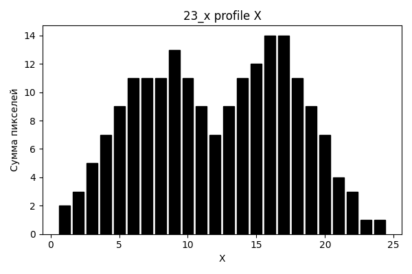 | 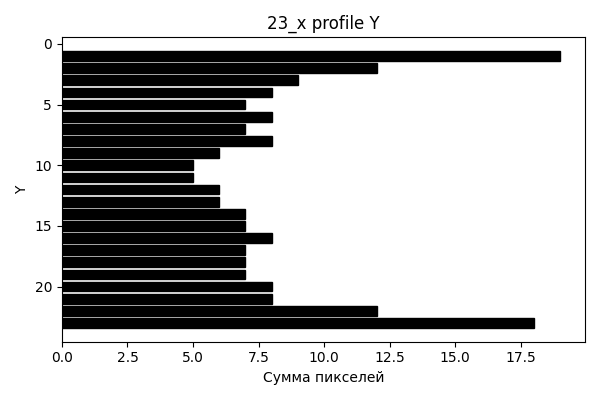 |

---

### 24. Символ «ц»

**Скалярные признаки:**

| Признак | Значение |
|---|---|
| Вес верхней левой четверти | 66 |
| Вес верхней правой четверти | 66 |
| Вес нижней левой четверти | 52 |
| Вес нижней правой четверти | 69 |
| Удельный вес верхней левой | 0.3626 |
| Удельный вес верхней правой | 0.3626 |
| Удельный вес нижней левой | 0.2667 |
| Удельный вес нижней правой | 0.3538 |
| Центр тяжести X | 13.2174 |
| Центр тяжести Y | 12.3834 |
| Норм. центр тяжести X | 0.5084 |
| Норм. центр тяжести Y | 0.4270 |
| Момент инерции X | 16561.81 |
| Момент инерции Y | 14137.04 |
| Норм. момент инерции X | 21.9653 |
| Норм. момент инерции Y | 18.7494 |

**Профили:**

| Профиль X | Профиль Y |
|---|---|
| 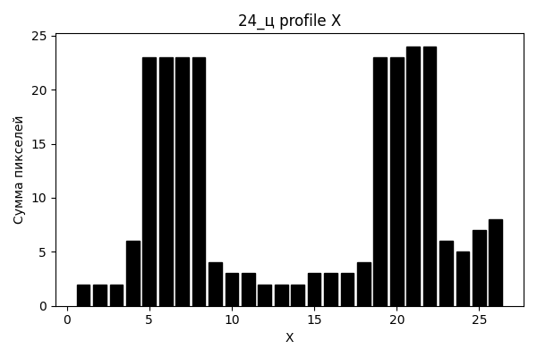 | 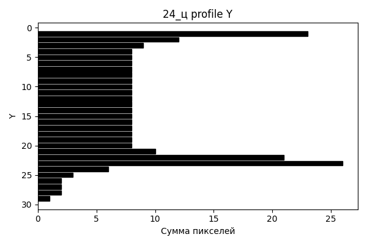 |

---

### 25. Символ «ч»

**Скалярные признаки:**

| Признак | Значение |
|---|---|
| Вес верхней левой четверти | 53 |
| Вес верхней правой четверти | 56 |
| Вес нижней левой четверти | 20 |
| Вес нижней правой четверти | 66 |
| Удельный вес верхней левой | 0.4015 |
| Удельный вес верхней правой | 0.4242 |
| Удельный вес нижней левой | 0.1389 |
| Удельный вес нижней правой | 0.4583 |
| Центр тяжести X | 12.9385 |
| Центр тяжести Y | 9.3333 |
| Норм. центр тяжести X | 0.5391 |
| Норм. центр тяжести Y | 0.4058 |
| Момент инерции X | 9321.33 |
| Момент инерции Y | 7741.26 |
| Норм. момент инерции X | 16.8865 |
| Норм. момент инерции Y | 14.0240 |

**Профили:**

| Профиль X | Профиль Y |
|---|---|
| 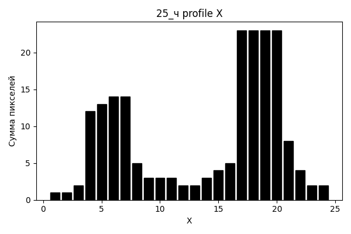 | 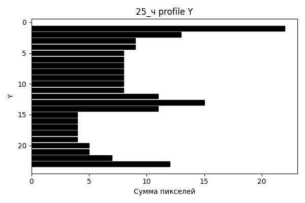 |

---

### 26. Символ «ш»

**Скалярные признаки:**

| Признак | Значение |
|---|---|
| Вес верхней левой четверти | 81 |
| Вес верхней правой четверти | 80 |
| Вес нижней левой четверти | 96 |
| Вес нижней правой четверти | 96 |
| Удельный вес верхней левой | 0.3876 |
| Удельный вес верхней правой | 0.3828 |
| Удельный вес нижней левой | 0.4211 |
| Удельный вес нижней правой | 0.4211 |
| Центр тяжести X | 18.4844 |
| Центр тяжести Y | 11.5524 |
| Норм. центр тяжести X | 0.4864 |
| Норм. центр тяжести Y | 0.5023 |
| Момент инерции X | 20647.28 |
| Момент инерции Y | 40654.16 |
| Норм. момент инерции X | 23.6239 |
| Норм. момент инерции Y | 46.5151 |

**Профили:**

| Профиль X | Профиль Y |
|---|---|
| 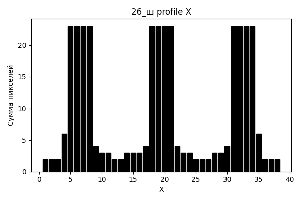 | 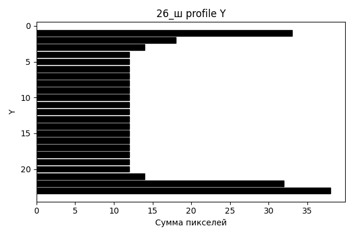 |

---

### 27. Символ «щ»

**Скалярные признаки:**

| Признак | Значение |
|---|---|
| Вес верхней левой четверти | 99 |
| Вес верхней правой четверти | 98 |
| Вес нижней левой четверти | 78 |
| Вес нижней правой четверти | 92 |
| Удельный вес верхней левой | 0.3722 |
| Удельный вес верхней правой | 0.3684 |
| Удельный вес нижней левой | 0.2737 |
| Удельный вес нижней правой | 0.3228 |
| Центр тяжести X | 19.1499 |
| Центр тяжести Y | 12.0490 |
| Норм. центр тяжести X | 0.5039 |
| Норм. центр тяжести Y | 0.4155 |
| Момент инерции X | 22965.12 |
| Момент инерции Y | 44772.76 |
| Норм. момент инерции X | 20.8395 |
| Норм. момент инерции Y | 40.6286 |

**Профили:**

| Профиль X | Профиль Y |
|---|---|
| 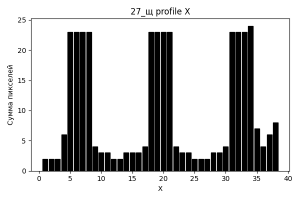 | 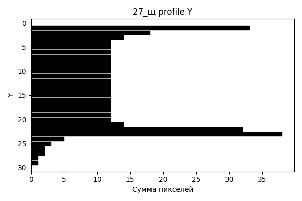 |

---

### 28. Символ «ъ»

**Скалярные признаки:**

| Признак | Значение |
|---|---|
| Вес верхней левой четверти | 66 |
| Вес верхней правой четверти | 13 |
| Вес нижней левой четверти | 54 |
| Вес нижней правой четверти | 75 |
| Удельный вес верхней левой | 0.5000 |
| Удельный вес верхней правой | 0.0909 |
| Удельный вес нижней левой | 0.3750 |
| Удельный вес нижней правой | 0.4808 |
| Центр тяжести X | 12.6298 |
| Центр тяжести Y | 12.0337 |
| Норм. центр тяжести X | 0.5052 |
| Норм. центр тяжести Y | 0.5232 |
| Момент инерции X | 10596.76 |
| Момент инерции Y | 7838.50 |
| Норм. момент инерции X | 18.4292 |
| Норм. момент инерции Y | 13.6322 |

**Профили:**

| Профиль X | Профиль Y |
|---|---|
| 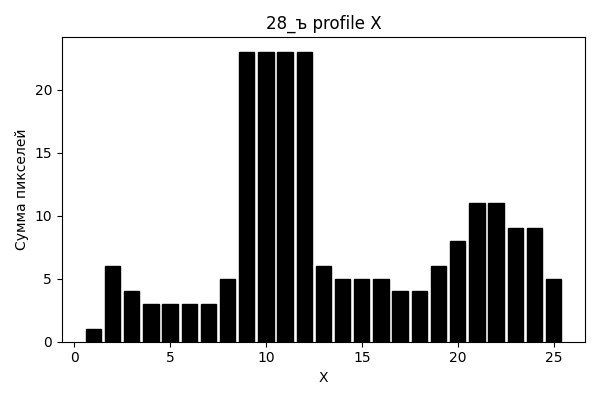 | 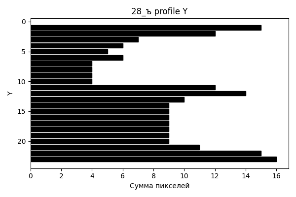 |

---

### 29. Символ «ы»

**Скалярные признаки:**

| Признак | Значение |
|---|---|
| Вес верхней левой четверти | 63 |
| Вес верхней правой четверти | 55 |
| Вес нижней левой четверти | 84 |
| Вес нижней правой четверти | 102 |
| Удельный вес верхней левой | 0.3580 |
| Удельный вес верхней правой | 0.2941 |
| Удельный вес нижней левой | 0.4375 |
| Удельный вес нижней правой | 0.5000 |
| Центр тяжести X | 15.8092 |
| Центр тяжести Y | 12.1283 |
| Норм. центр тяжести X | 0.4791 |
| Норм. центр тяжести Y | 0.5273 |
| Момент инерции X | 15442.00 |
| Момент инерции Y | 26812.93 |
| Норм. момент инерции X | 20.3452 |
| Норм. момент инерции Y | 35.3267 |

**Профили:**

| Профиль X | Профиль Y |
|---|---|
| 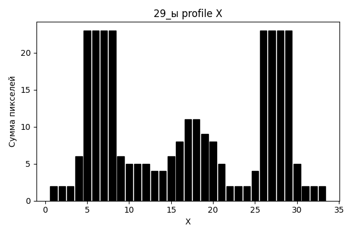 | 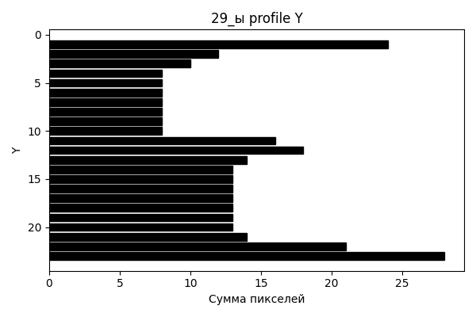 |

---

### 30. Символ «ь»

**Скалярные признаки:**

| Признак | Значение |
|---|---|
| Вес верхней левой четверти | 55 |
| Вес верхней правой четверти | 8 |
| Вес нижней левой четверти | 60 |
| Вес нижней правой четверти | 68 |
| Удельный вес верхней левой | 0.5000 |
| Удельный вес верхней правой | 0.0661 |
| Удельный вес нижней левой | 0.5000 |
| Удельный вес нижней правой | 0.5152 |
| Центр тяжести X | 9.4712 |
| Центр тяжести Y | 12.8429 |
| Норм. центр тяжести X | 0.4510 |
| Норм. центр тяжести Y | 0.5584 |
| Момент инерции X | 8715.29 |
| Момент инерции Y | 5749.59 |
| Норм. момент инерции X | 18.0441 |
| Норм. момент инерции Y | 11.9039 |

**Профили:**

| Профиль X | Профиль Y |
|---|---|
| 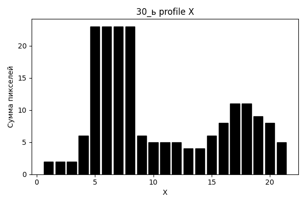 | 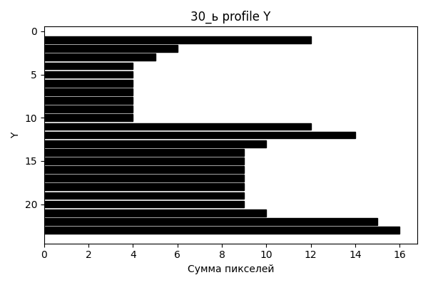 |

---

### 31. Символ «ѣ»

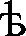

**Скалярные признаки:**

| Признак | Значение |
|---|---|
| Вес верхней левой четверти | 102 |
| Вес верхней правой четверти | 22 |
| Вес нижней левой четверти | 83 |
| Вес нижней правой четверти | 85 |
| Удельный вес верхней левой | 0.4359 |
| Удельный вес верхней правой | 0.0940 |
| Удельный вес нижней левой | 0.3547 |
| Удельный вес нижней правой | 0.3632 |
| Центр тяжести X | 12.4110 |
| Центр тяжести Y | 20.4623 |
| Норм. центр тяжести X | 0.4773 |
| Норм. центр тяжести Y | 0.5684 |
| Момент инерции X | 28862.59 |
| Момент инерции Y | 10542.68 |
| Норм. момент инерции X | 30.8361 |
| Норм. момент инерции Y | 11.2636 |

**Профили:**

| Профиль X | Профиль Y |
|---|---|
| 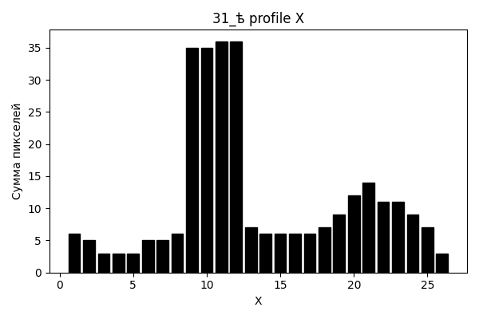 | 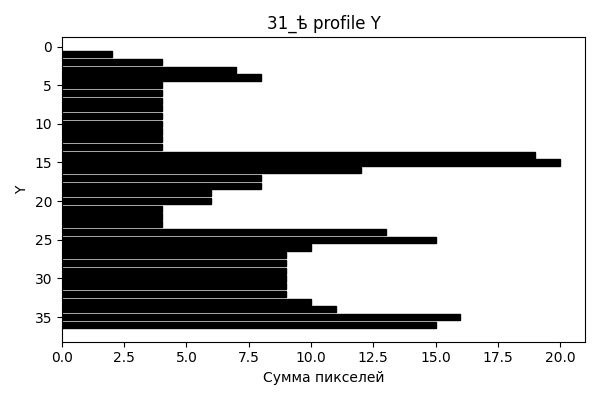 |

---

### 32. Символ «ю»

**Скалярные признаки:**

| Признак | Значение |
|---|---|
| Вес верхней левой четверти | 85 |
| Вес верхней правой четверти | 72 |
| Вес нижней левой четверти | 93 |
| Вес нижней правой четверти | 80 |
| Удельный вес верхней левой | 0.4293 |
| Удельный вес верхней правой | 0.3636 |
| Удельный вес нижней левой | 0.4306 |
| Удельный вес нижней правой | 0.3704 |
| Центр тяжести X | 17.4970 |
| Центр тяжести Y | 11.0212 |
| Норм. центр тяжести X | 0.4860 |
| Норм. центр тяжести Y | 0.4792 |
| Момент инерции X | 15048.85 |
| Момент инерции Y | 38170.50 |
| Норм. момент инерции X | 18.1749 |
| Норм. момент инерции Y | 46.0996 |

**Профили:**

| Профиль X | Профиль Y |
|---|---|
| 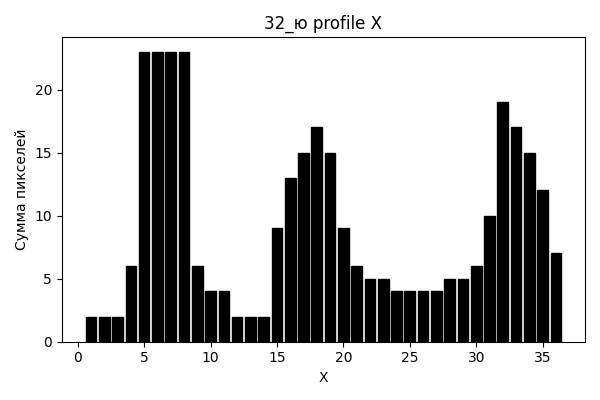 | 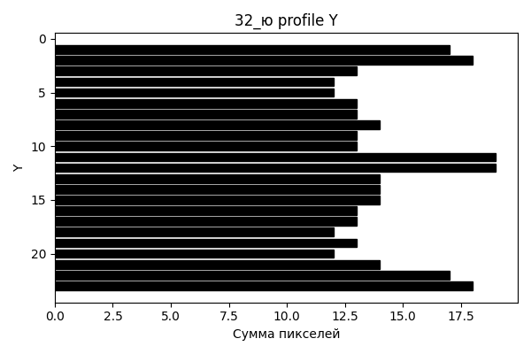 |

---

### 33. Символ «ѵ»

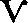

**Скалярные признаки:**

| Признак | Значение |
|---|---|
| Вес верхней левой четверти | 61 |
| Вес верхней правой четверти | 43 |
| Вес нижней левой четверти | 42 |
| Вес нижней правой четверти | 20 |
| Удельный вес верхней левой | 0.3961 |
| Удельный вес верхней правой | 0.2792 |
| Удельный вес нижней левой | 0.2500 |
| Удельный вес нижней правой | 0.1190 |
| Центр тяжести X | 12.8133 |
| Центр тяжести Y | 8.3976 |
| Норм. центр тяжести X | 0.4576 |
| Норм. центр тяжести Y | 0.3651 |
| Момент инерции X | 6479.76 |
| Момент инерции Y | 7153.21 |
| Норм. момент инерции X | 10.0617 |
| Норм. момент инерции Y | 11.1075 |

**Профили:**

| Профиль X | Профиль Y |
|---|---|
| 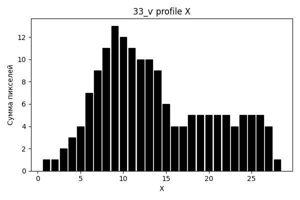 | 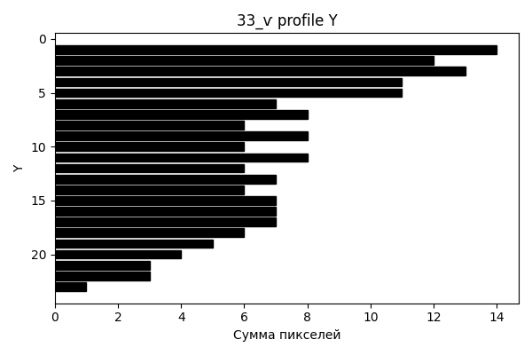 |

---

### 34. Символ «ѯ»

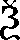

**Скалярные признаки:**

| Признак | Значение |
|---|---|
| Вес верхней левой четверти | 52 |
| Вес верхней правой четверти | 74 |
| Вес нижней левой четверти | 70 |
| Вес нижней правой четверти | 72 |
| Удельный вес верхней левой | 0.2600 |
| Удельный вес верхней правой | 0.3700 |
| Удельный вес нижней левой | 0.3500 |
| Удельный вес нижней правой | 0.3600 |
| Центр тяжести X | 9.6194 |
| Центр тяжести Y | 20.6231 |
| Норм. центр тяжести X | 0.4810 |
| Норм. центр тяжести Y | 0.5156 |
| Момент инерции X | 38692.94 |
| Момент инерции Y | 8071.18 |
| Норм. момент инерции X | 48.3662 |
| Норм. момент инерции Y | 10.0890 |

**Профили:**

| Профиль X | Профиль Y |
|---|---|
| 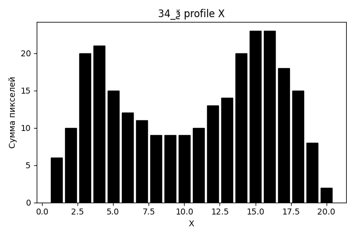 | 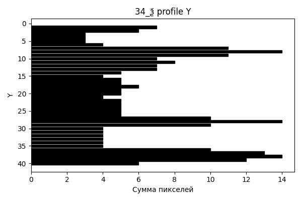 |

---

### 35. Символ «ѱ»

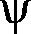

**Скалярные признаки:**

| Признак | Значение |
|---|---|
| Вес верхней левой четверти | 95 |
| Вес верхней правой четверти | 113 |
| Вес нижней левой четверти | 48 |
| Вес нижней правой четверти | 55 |
| Удельный вес верхней левой | 0.3725 |
| Удельный вес верхней правой | 0.4154 |
| Удельный вес нижней левой | 0.1882 |
| Удельный вес нижней правой | 0.2022 |
| Центр тяжести X | 14.7942 |
| Центр тяжести Y | 12.6752 |
| Норм. центр тяжести X | 0.4772 |
| Норм. центр тяжести Y | 0.3728 |
| Момент инерции X | 21012.20 |
| Момент инерции Y | 16720.83 |
| Норм. момент инерции X | 19.9357 |
| Норм. момент инерции Y | 15.8642 |

**Профили:**

| Профиль X | Профиль Y |
|---|---|
| 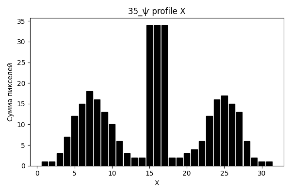 | 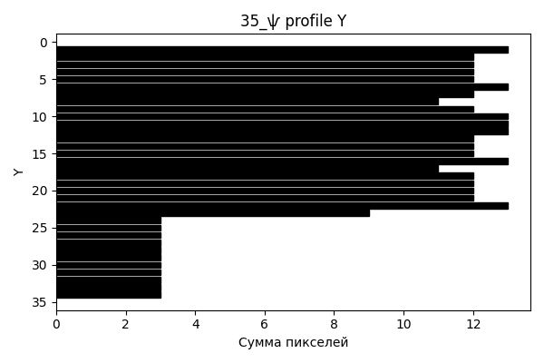 |

---

### 36. Символ «ѡ»

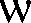

**Скалярные признаки:**

| Признак | Значение |
|---|---|
| Вес верхней левой четверти | 59 |
| Вес верхней правой четверти | 79 |
| Вес нижней левой четверти | 59 |
| Вес нижней правой четверти | 58 |
| Удельный вес верхней левой | 0.3576 |
| Удельный вес верхней правой | 0.4489 |
| Удельный вес нижней левой | 0.3278 |
| Удельный вес нижней правой | 0.3021 |
| Центр тяжести X | 14.6706 |
| Центр тяжести Y | 9.7098 |
| Норм. центр тяжести X | 0.4732 |
| Норм. центр тяжести Y | 0.4222 |
| Момент инерции X | 9262.53 |
| Момент инерции Y | 18836.33 |
| Норм. момент инерции X | 12.9909 |
| Норм. момент инерции Y | 26.4184 |

**Профили:**

| Профиль X | Профиль Y |
|---|---|
| 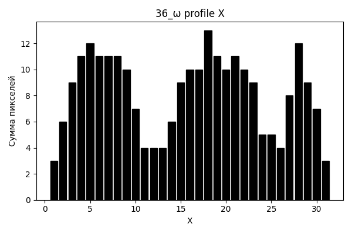 | 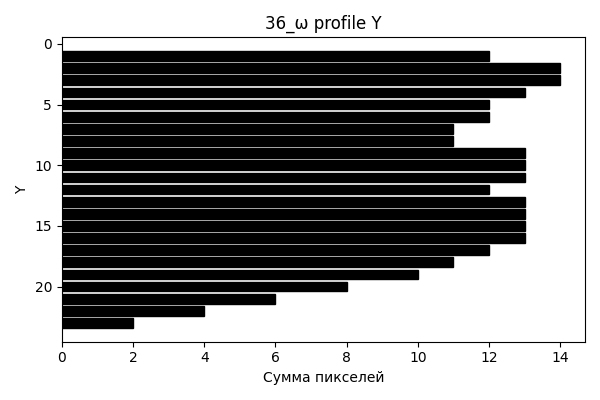 |

---

### 37. Символ «ѳ»

**Скалярные признаки:**

| Признак | Значение |
|---|---|
| Вес верхней левой четверти | 62 |
| Вес верхней правой четверти | 58 |
| Вес нижней левой четверти | 64 |
| Вес нижней правой четверти | 65 |
| Удельный вес верхней левой | 0.5124 |
| Удельный вес верхней правой | 0.4793 |
| Удельный вес нижней левой | 0.4848 |
| Удельный вес нижней правой | 0.4924 |
| Центр тяжести X | 10.4458 |
| Центр тяжести Y | 10.8996 |
| Норм. центр тяжести X | 0.4748 |
| Норм. центр тяжести Y | 0.4739 |
| Момент инерции X | 9136.49 |
| Момент инерции Y | 11007.52 |
| Норм. момент инерции X | 18.0563 |
| Норм. момент инерции Y | 21.7540 |

**Профили:**

| Профиль X | Профиль Y |
|---|---|
| 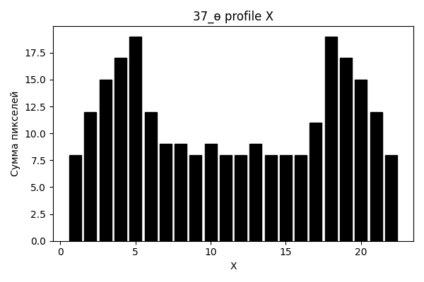 | 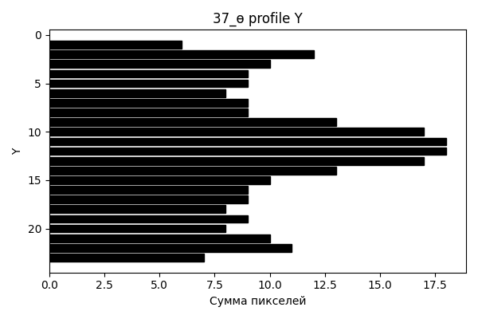 |

---

### 38. Символ «ѧ»

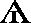

**Скалярные признаки:**

| Признак | Значение |
|---|---|
| Вес верхней левой четверти | 23 |
| Вес верхней правой четверти | 37 |
| Вес нижней левой четверти | 74 |
| Вес нижней правой четверти | 80 |
| Удельный вес верхней левой | 0.1394 |
| Удельный вес верхней правой | 0.2102 |
| Удельный вес нижней левой | 0.4111 |
| Удельный вес нижней правой | 0.4167 |
| Центр тяжести X | 15.4065 |
| Центр тяжести Y | 13.9953 |
| Норм. центр тяжести X | 0.4970 |
| Норм. центр тяжести Y | 0.6085 |
| Момент инерции X | 8181.00 |
| Момент инерции Y | 9061.63 |
| Норм. момент инерции X | 11.4740 |
| Норм. момент инерции Y | 12.7092 |

**Профили:**

| Профиль X | Профиль Y |
|---|---|
| 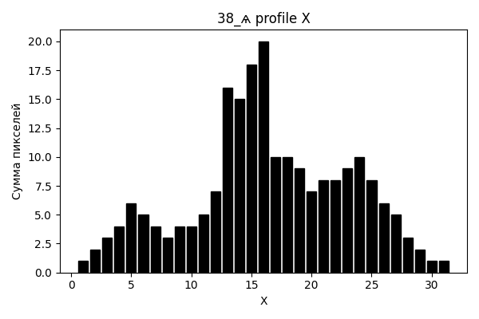 | 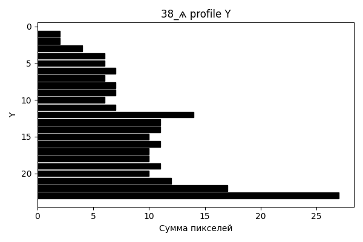 |

---

### 39. Символ «ѫ»

**Скалярные признаки:**

| Признак | Значение |
|---|---|
| Вес верхней левой четверти | 58 |
| Вес верхней правой четверти | 37 |
| Вес нижней левой четверти | 95 |
| Вес нижней правой четверти | 95 |
| Удельный вес верхней левой | 0.3102 |
| Удельный вес верхней правой | 0.1979 |
| Удельный вес нижней левой | 0.4657 |
| Удельный вес нижней правой | 0.4657 |
| Центр тяжести X | 16.2105 |
| Центр тяжести Y | 12.4632 |
| Норм. центр тяжести X | 0.4768 |
| Норм. центр тяжести Y | 0.5419 |
| Момент инерции X | 14802.86 |
| Момент инерции Y | 16361.37 |
| Норм. момент инерции X | 18.9295 |
| Норм. момент инерции Y | 20.9225 |

**Профили:**

| Профиль X | Профиль Y |
|---|---|
| 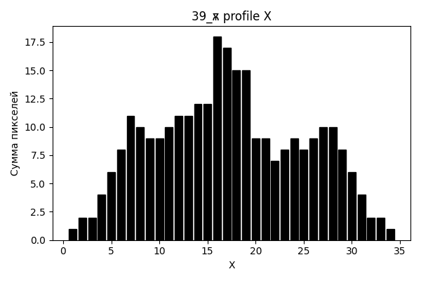 | 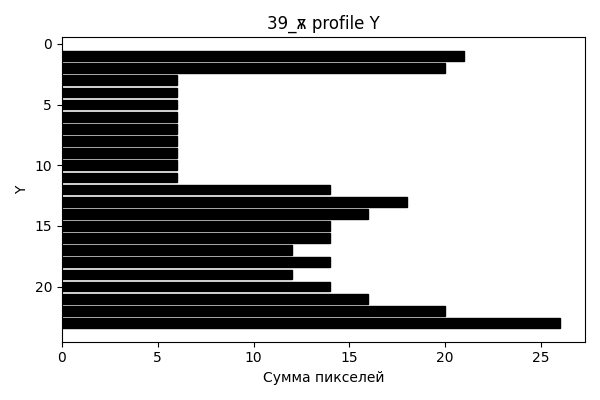 |

---
