# Лабораторная работа №6. Сегментация текста

Вариант 5: Кириллица, строчные буквы - абвгдежѕзиiклмнопрстуфхцчшщъыьѣюѵѯѱѡѳѧѫ
Шрифт: Times New Roman, кегль 52.

В качестве романтической фразы выбрана:

> ты моѣ счастье

Исходное изображение:

## Профили изображения
Профили фразы:

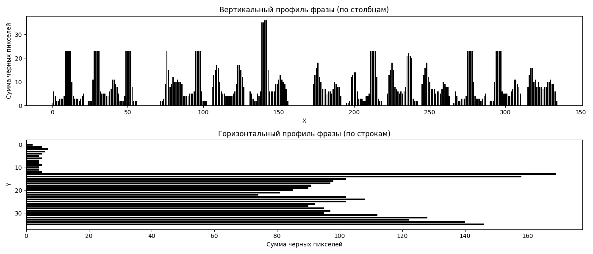

На вертикальном профиле видны нули - это пробелы между буквами и между словами. По ним и строится сегментация.

## Задание 3. Сегментация символов

Фраза с обрамляющими прямоугольниками вокруг каждого символа:

### Вырезанные символы фразы (в порядке чтения)

| № | Символ | Координаты (x1, y1, x2, y2) |
|:---:|:---:|:---:|
| 0 |  | (0, np.int64(13), 21, np.int64(35)) |
| 1 |  | (24, np.int64(13), 56, np.int64(35)) |
| 2 |  | (72, np.int64(13), 102, np.int64(35)) |
| 3 |  | (106, np.int64(13), 127, np.int64(35)) |
| 4 |  | (131, np.int64(0), 156, np.int64(35)) |
| 5 |  | (173, np.int64(13), 191, np.int64(35)) |
| 6 |  | (195, np.int64(13), 218, np.int64(35)) |
| 7 |  | (222, np.int64(13), 242, np.int64(35)) |
| 8 |  | (245, np.int64(13), 263, np.int64(35)) |
| 9 |  | (266, np.int64(13), 287, np.int64(35)) |
| 10 |  | (290, np.int64(13), 310, np.int64(35)) |
| 11 |  | (315, np.int64(13), 334, np.int64(35)) |

## Задание 4. Профили символов алфавита

### Эталонные изображения и профили символов фразы

| Символ | Эталон | Профили (X и Y) |
|:---:|:---:|:---:|
| т |  | 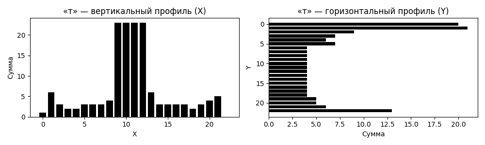 |
| ы |  | 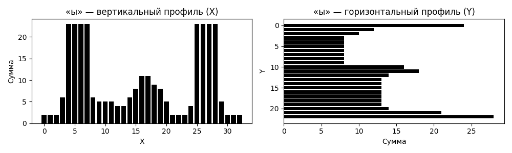 |
| м |  | 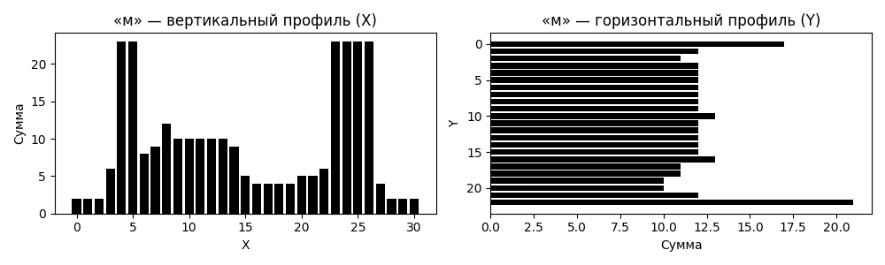 |
| о |  | 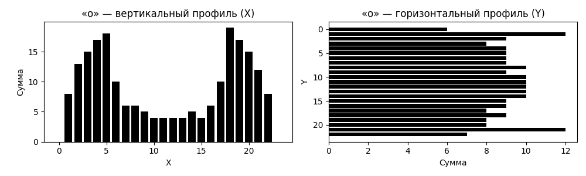 |
| ѣ | 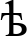 | 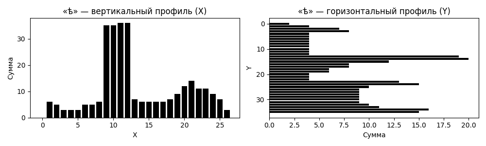 |
| с |  | 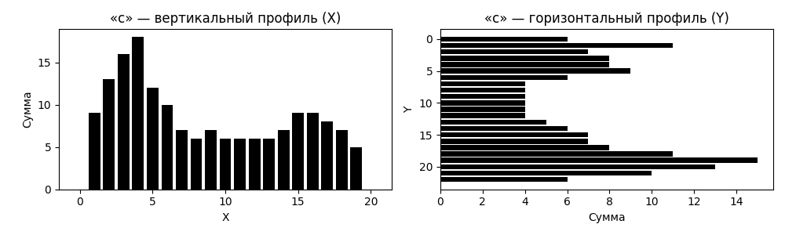 |
| ч |  | 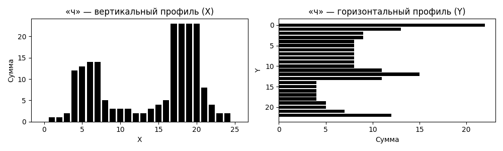 |
| а |  | 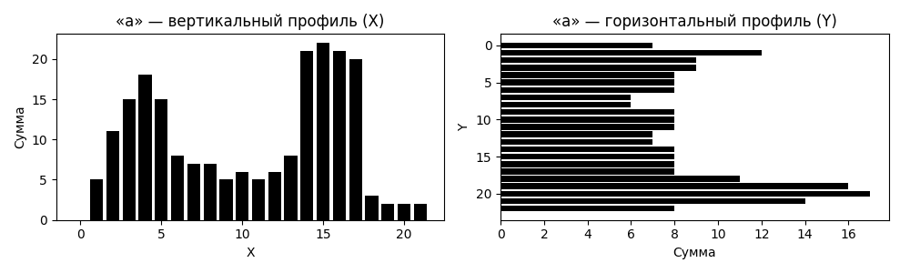 |
| ь |  | 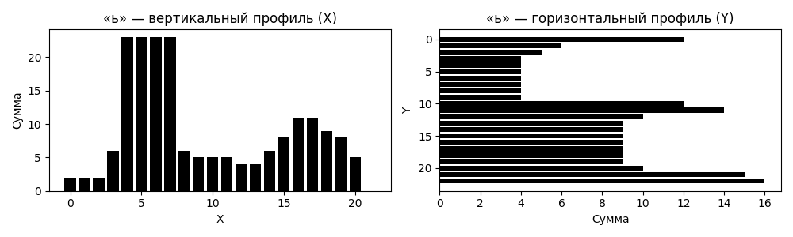 |
| е |  | 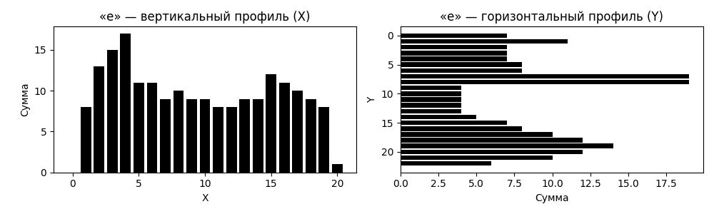 |
