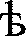

### Гипотезы по каждому символу (топ-5)

| № | Символ | Топ-5 гипотез |
|:---:|:---:|:---|
| 0 |  | `т` (0.967), `р` (0.952), `ч` (0.943), `ѱ` (0.940), `ѡ` (0.935) |
| 1 |  | `ы` (0.990), `а` (0.980), `ш` (0.969), `ѕ` (0.962), `ж` (0.955) |
| 2 |  | `м` (0.993), `н` (0.977), `и` (0.975), `ж` (0.973), `ю` (0.972) |
| 3 |  | `ю` (0.973), `о` (0.972), `м` (0.965), `н` (0.963), `и` (0.962) |
| 4 |  | `ѣ` (0.975), `ѫ` (0.959), `i` (0.953), `ѧ` (0.951), `ѯ` (0.946) |
| 5 |  | `с` (0.960), `к` (0.951), `ь` (0.941), `е` (0.941), `ѕ` (0.930) |
| 6 |  | `ч` (0.963), `ц` (0.951), `щ` (0.949), `з` (0.932), `ѡ` (0.929) |
| 7 |  | `а` (0.964), `ѕ` (0.955), `ы` (0.954), `е` (0.954), `к` (0.951) |
| 8 |  | `с` (0.960), `к` (0.951), `ь` (0.941), `е` (0.941), `ѕ` (0.930) |
| 9 |  | `т` (0.967), `р` (0.952), `ч` (0.943), `ѱ` (0.940), `ѡ` (0.935) |
| 10 |  | `ь` (0.973), `ы` (0.954), `а` (0.951), `к` (0.937), `е` (0.934) |
| 11 |  | `к` (0.971), `е` (0.966), `ѕ` (0.952), `ю` (0.943), `и` (0.942) |

### Сравнение строк посимвольно

| № | Ожидалось | Распознано | Верно |
|:---:|:---:|:---:|:---:|
| 0 | т | т | ✓ |
| 1 | ы | ы | ✓ |
| 2 | м | м | ✓ |
| 3 | о | ю | ✗ |
| 4 | ѣ | ѣ | ✓ |
| 5 | с | с | ✓ |
| 6 | ч | ч | ✓ |
| 7 | а | а | ✓ |
| 8 | с | с | ✓ |
| 9 | т | т | ✓ |
| 10 | ь | ь | ✓ |
| 11 | е | к | ✗ |

### Результаты эксперимента с разными кеглями

| Кегль | Распознанная строка | Ошибок | Точность |
|:---:|:---|:---:|:---:|
| 40 | тамоѣсчастьк | 2/12 | 83.3% |
| 52 | тымюѣсчастьк | 2/12 | 83.3% |
| 64 | тымоѣсчастье | 0/12 | 100.0% |
