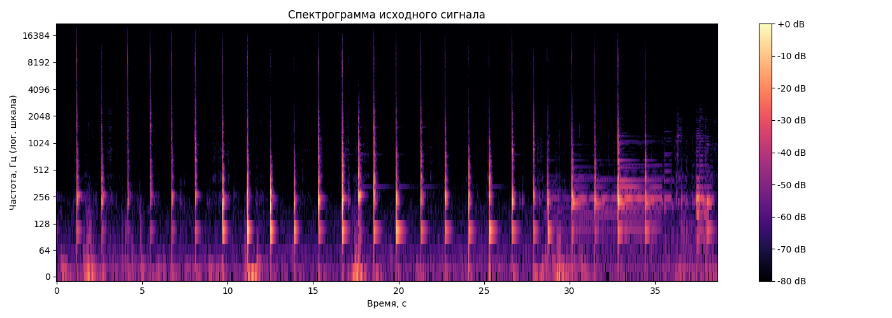
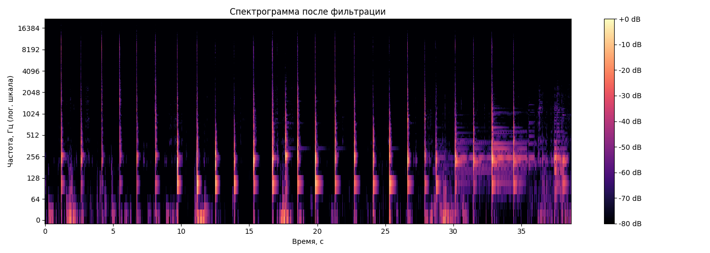
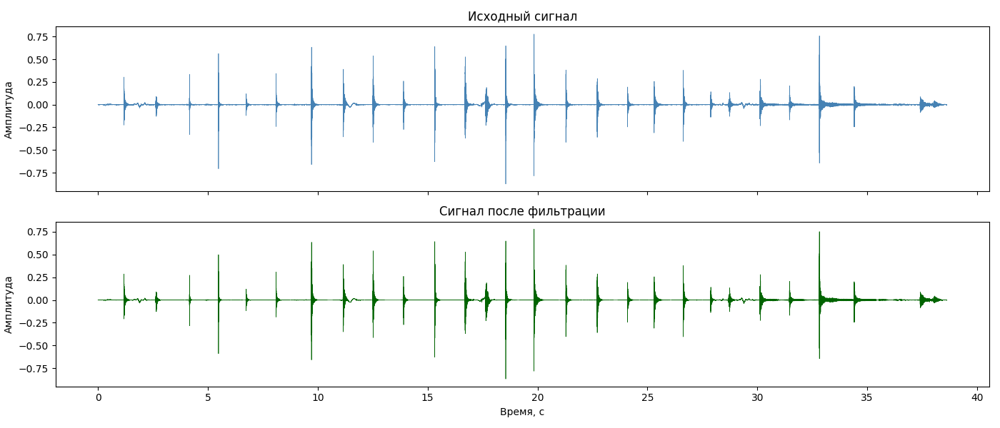
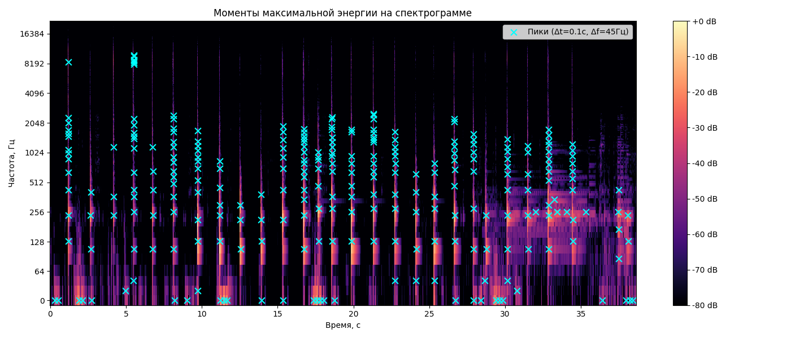

# Лабораторная работа №9. Анализ шума

## Исходный файл и спектрограмма

В качестве материала использована запись акустической гитары в формате WAV (моно).
Параметры файла:
- частота дискретизации: 44100 Гц
- каналов: 1 (моно)
- длительность: 38.62 сек
- количество отсчетов: 1 703 228

Для построения спектрограммы используется оконное преобразование Фурье, в качестве оконной функции выбрано окно Ханна

Частоты отображаются на логарифмической шкале.
Спектрограмма исходного сигнала:

## Оценка и подавление шума

$$\text{SNR} = 20 \log_{10} \frac{\text{RMS}_{\text{сигнал}}}{\text{RMS}_{\text{шум}}}$$

Результаты:
| | |
|---|---|
| RMS шума | 0.00192 |
| RMS сигнала | 0.02364 |
| SNR | 21.82 дБ |

Применены два метода последовательно:

1. Спектральное вычитание. Оценивается средний спектр шума по тихому участку. Затем из спектра всего сигнала вычитается этот шум (с обнулением отрицательных значений). После обратного получаем очищенный сигнал.

2. Фильтр Савицкого-Голея. Удаляет высокочастотный шум, сохраняя резкие переходы лучше, чем простое усреднение.

Результат фильтрации: RMS шума снизился с 0.00192 до 0.00118 (−39%).

Спектрограмма после фильтрации:

Сравнение волн до и после:

## Моменты максимальной энергии

Поиск точек максимальной энергии в окрестности Δt = 0.1 с и Δf = 45 Гц дает набор моментов времени и частот, где сосредоточена основная энергия сигнала.
Найдено подобных пиков: 268

## Выводы

Построена спектрограмма аудиозаписи. Оценен уровень шума: SNR составил около 22 дБ. После фильтрации спектральным вычитанием и сглаживанием Савицкого-Голея уровень шума снизился на ~39.

Алгоритм поиска пиков энергии нашел 268 точек максимальной энергии в окрестности Δt = 0.1 с и Δf = 45 Гц. Большинство пиков расположены в диапазоне 130–280 Гц. Они хорошо совпадают с моментами атак нот в записи.